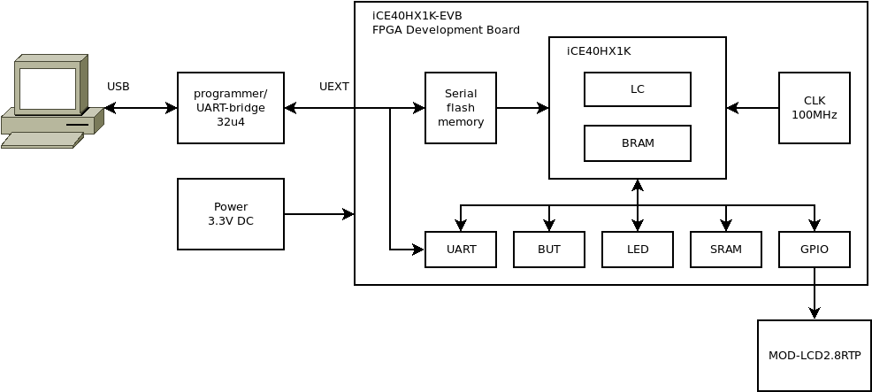
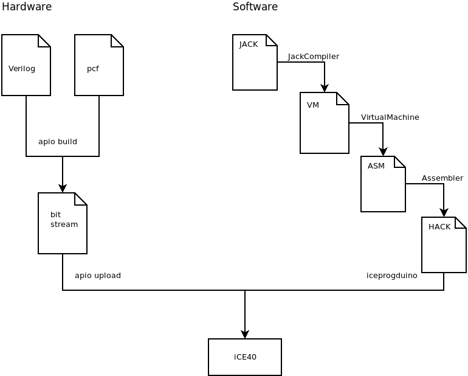
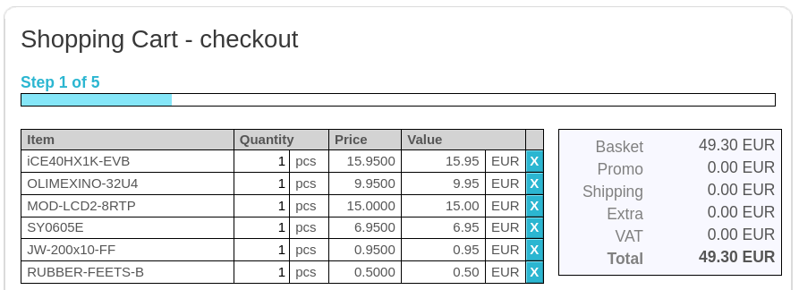
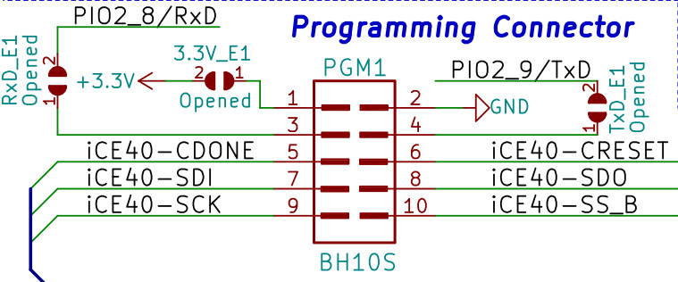
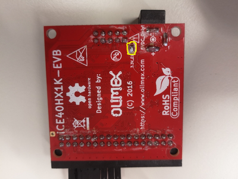

## 00 Prerequisites

### FPGA Board

In this project we will implement the `HACK` computer of the nand2tetris course on real hardware. This is done with a development board featuring a so called Field Programmable Gate Array (FPGA). The FPGA chip is a small piece of silicon holding lots of logic cells (LC) and BRAM, which can be routed programmatically.

In this tutorial we use the FPGA-board `iCE40HX1K-EVB` from Olimex Ltd., which has the nice property of being completely open source. The whole project uses only FOSS free and open source hardware and software, so everybody can build their own `HACK` following these instructions.



On `iCE40HX1K-EVB` board you will find:

* FPGA chip `iCE40HX1K`: holds 1280 logic cells and 64K bits BRAM which can be routed programmatically.
* Serial flash memory `W25Q16BV` (16M bits): holds the bitstream data which is a binary representation of the circuits you want to implement on the FPGA. At startup the FPGA loads the bitstream from serial flash memory and configures its logic cells to become the machine you want the FPGA to be.
* `LED`, `BUT`: The development board comes with two LEDs and two buttons. These are user programmable and can be used to enter data or for debugging.
* SRAM (256K x 16 bits): `iCE40HX1K-EVB` has a Static RAM (SRAM) chip on board. This is useful, because more memory is needed than available with BRAM inside FPGA. We will use the SRAM chip as instruction memory ROM to run serious applications like Tetris or Pong on `HACK`.
* GPIO 34 pin connector: the board come with a lot of general purpose I/O pins. These pins can be used to connect external hardware and we will use these pins to connect an `LCD` screen with touch panel `MOD-LCD2.8RTP`.

To communicate to the `iCE40HX1K-EVB` we need an Arduino-like board, which can be connected to `iCE40HX1K` over the 10 pin UEXT connector. We will use `olimexino-32u4` board, which has two modes:

* Programmer: used to upload the bitstream file to serial flash memory.
* UART bridge: used to communicate to `HACK` at runtime.

### Tools

The chips of our `HACK` computer (`ALU`, `CPU`, `Register`, `Memory`, I/O devices) are implemented in verilog, an industrial standard hardware description language similar to HDL from nand2tetris. So we need tools to translate Verilog code to the so called bitstream, which is a binary representation of all the wires between the logic cells we want to activate. Finally we need tools to upload the bitstream file to the FPGA board.

We will use iCE40 FPGA from Lattice Semiconductors, because they have the nice property that there exists a complete free and open source toolchain [Project Icestorm](http://www.clifford.at/icestorm/) for programming:

* `YoSYS`: Synthesize the Verilog code.
* `nextpnr`: place and route tool.
* `iceprogduino`: programmer.
* `gtkwave`: tool to simulate and visualize signals in FPGA circuits.



To run `HACK` we also need some software written for `HACK`. The simpler projects like a blinking LED can be programmed direcly in Assembler. Harder tasks like the driver for the `LCD` screen are programmed in Jack, translated for the virtual machine and finally compiled to `HACK` code.

***

## Get started

### Buy the hardware

To build Projects 1-5 any FPGA board will work. If you want to run serious application like Pong or Tetris on top of the Jack OS you need an FPGA board with more memory and connect to I/O devices like a screen and a touch panel. The project has been tested with the following devices:

* iCE40 Board: [iCE40HX1K-EVB](https://www.olimex.com/Products/FPGA/iCE40/)
* Programmer: [olimexino-32u4](https://www.olimex.com/Products/Duino/AVR/OLIMEXINO-32U4/open-source-hardware)
* 2.8 Inch `LCD` color screen with `RTP`: [MOD-LCD2.8RTP](https://www.olimex.com/Products/Modules/LCD/MOD-LCD2-8RTP)



### Prepare the development environment

If going with an Olimex board/toolchain the Windows version of `iceprogduino` does not support the necessary features so a Linux environment is required. If using Windows Subsystem for Linux then [usbipd](https://github.com/dorssel/usbipd-win) will be necessary to interface with the Arduino (the native WSL implementation for COM based passthrough is also lacking features required by `iceprogduino`).

Any reasonably modern Linux distribution should work in either case.

## Install the tools

### apio

Apio is a multiplatform toolbox, with static pre-built packages, project configuration tools and easy command interface to verify, synthesize, simulate and upload your Verilog designs.

 Visit [apio](https://github.com/FPGAwars/apio) and follow the install instruction. This will automatically install the whole toolchain consisting of:

* iCE40 tools: [Project Icestorm](http://www.clifford.at/icestorm/)
* Signal visualizer: [gtkwave](http://gtkwave.sourceforge.net/)
  * The `gtkwave` package that is installable via `apio` is Windows-only but should be available in your preferred package manager for Linux.

```sh
$ pip install -U apio
```

 To learn usage of apio do the example projects provided by apio.

```sh
$ apio install oss-cad-suite
$ apio install examples
$ apio examples -d iCE40-HX1K-EVB/leds
$ cd iCE40-HX1K-EVB/leds
$ apio sim
$ apio build
$ apio upload
```

### Programmer olimexino-32u4

If you go with Olimex boards you additionally have to install the programmer software [iceprogduino](https://github.com/OLIMEX/iCE40HX1K-EVB/tree/master/programmer/olimexino-32u4%20firmware). The firmware has to be flashed on `olimexino-32u4` with the Arduino development platform, alternatively refer to the official Olimex [documentation](https://www.olimex.com/wiki/ICE40HX1K-EVB#Preparing_OLIMEXINO-32U4_as_programmer) for more detailed instructions.

Additionally you have to install the program iceprogduino on your computer:

```sh
$ git clone https://github.com/OLIMEX/iCE40HX1K-EVB.git
$ cd iCE40HX1K-EVB/programmer/iceprogduino
$ make
$ sudo make install
```

Test the programmer with the test project provided by Olimex.

**Tip:** Connect the solder jumper 3.3V_E1 on `iCE40HX1K-EVB` to power the FPGA board `iCE40HX1K-EVB` over the IDC10 cable connected to `olimexino-32u4` over UEXT. This supersedes the need for the external 3.3V DC power supply but you can still use one if having power stability issues over USB.

 



### Jack-HACK-tools

Jack-HACK-Tools: JackCompiler, VirtualMachine Translator and Assembler for `HACK` should be developed by yourself. Follow guidelines at [nand2tetris](https://www.nand2tetris.org/). If you don't have  your own Jack-HACK-tools yet, you can use the compiled python version the Jack-HACK toolchain provided in the folder [tools](../tools).

### Do some Verilog examples

There is no need to learn much Verilog at first. Just dig into the example `Xor` and learn how to "translate" your HDL files from nand2tetris into Verilog.

If you want to have some Verilog background I recommend doing the tutorial of Juan González-Gomez (Obijuan), which starts at an absolute beginners level [open-fpga-verilog-tutorial](https://github.com/Obijuan/open-fpga-verilog-tutorial/).

### Appendix

Abridged notes for end to end environment setup are available in [Appendix.md](Appendix.md).
