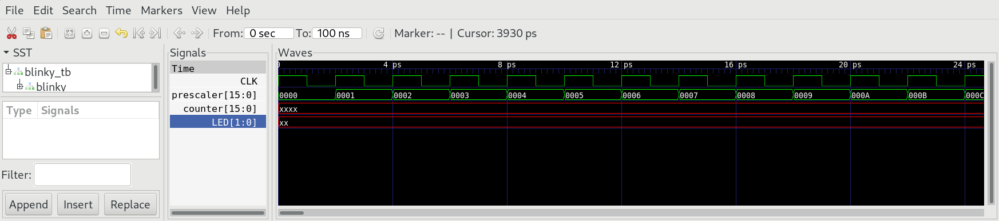
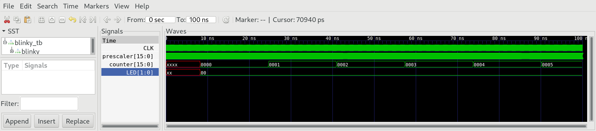

# 03 Sequential Logic

Build sequential chips `Bit` , `Register` and `PC`, that make use of the Data Flip-Flop (DFF) to store the state. `DFF` is considered primitive, so it's not necessary to implement it. The memory chips `RAM512` and `RAM3584` are based on the primitive `RAM256`, which uses BRAM structures integrated in `iCE40HX1K`. `BitShift9R` and `BitShift8L` are new chips not explained in the original nand2tetris course. They serve to connect `HACK` to different I/O devices which are connected using a serial protocol where data is transmitted bitwise.

## 08 Blinky

The folder `08_Blinky` contains a project to test the counter `PC` on real hardware. Blinky uses counters `PC` to scale down the frequency of 100 MHz provided by the clock oscillator on `iCE40HX1K-EVB` and finally drives the `LED1/2`.

***

### Project

* Implement the chips `Bit`, `Register`, `PC`, `RAM512`, `RAM3584`,  `BitShift9R` and  `BitShift8L` using `DFF` as primitive building block.

* Implement the chips `RAM512` and `RAM3584` using `RAM256` as primitive building block.

* For every chip we provide a test bench in the dedicated folder:
  
  ```sh
  $ cd <0X_chip>
  $ apio clean
  $ apio sim
  ```

* Run Blinky in simulation:
  
  ```sh
  $ cd 08_Blinky
  $ apio clean
  $ apio sim
  ```

* Zoom in to check the prescaler:
  
  

* Zoom out to check the counter:
  
  

* Upload the project to `iCE40HX1K-EVB` end test on real hardware:
  
  ```sh
  $ cd 08_Blinky
  $ apio clean
  $ apio upload
  ```

* Look at `LED1/2` and see if they blink.