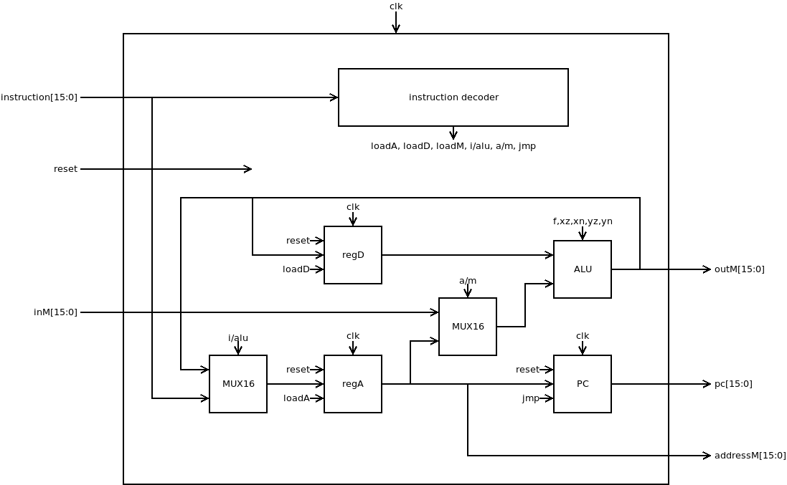
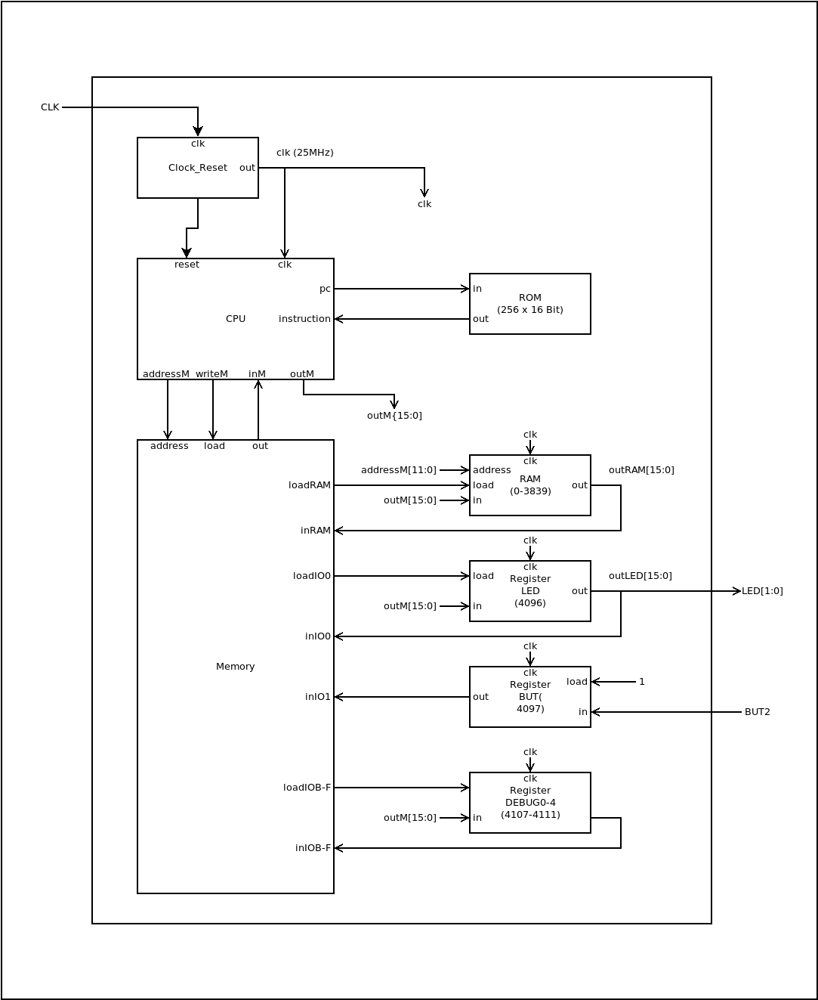
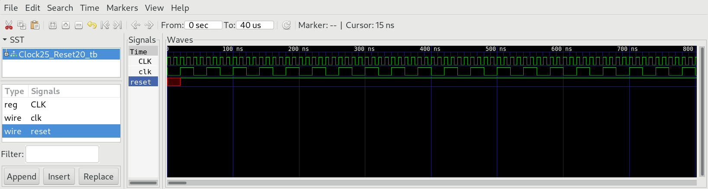
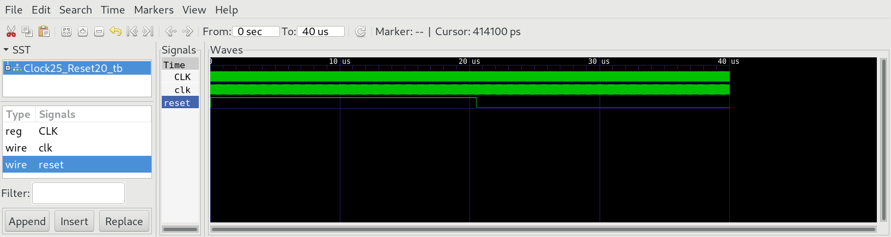
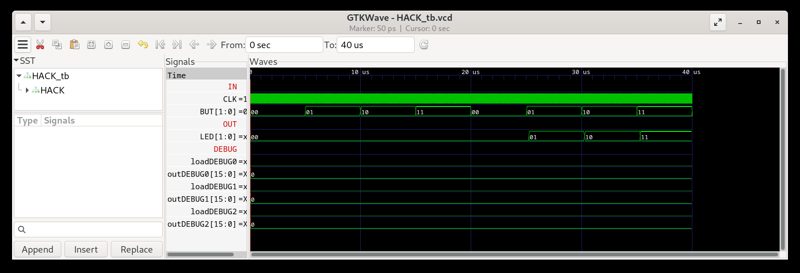
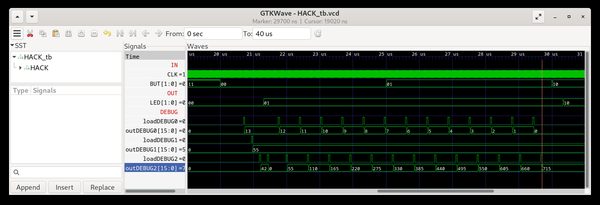

# 05 Computer Architecture

Build the `HACK` computer system consisting of the chips `CPU`, `Memory`, `Clock25_Reset20`, RAM and `ROM`. `ROM` uses a BRAM structure (256 words) of `iCE40HX1K` and can be considered primitive. It can be preloaded with the instructions of the assembler programs implemented in `04_Machine_Language`.

### 01 CPU

The `CPU` corresponds to the proposed implementation of nand2tetris course.



**Attention:** In the original specification of `HACK` all C instructions have the binary form: `111xxxxxxxxxxxxx` and A instruction have the form `0xxxxxxxxxxxxxxx`. In order to use `HACK` with instruction memory ROM >32K (to play Tetris), we will also interpret the machine language instructions starting with `000-110` as A-instructions, allowing up to 112KB (56K words) of memory to be addressed:

`0x0-0xDFFF` (112KB / 56K words) = A instructions, a superset of the original range.

`0xE000-FFFF` (16KB / 8K words) = C instructions, a subset of the original range.

```
@label
0;JMP
```

### 02 Memory

The chip `Memory.v` maps all addresses `0-0x0FFF` to RAM and the addresses `0x1000-0x100F` to the 16 special function registers used for memory mapped I/O devices and debugging.

### 03 Clock25_Reset20

The 100 MHz of the clock generator on the `iCE40HX1K-EVB` is too fast to drive our `HACK` design. Therefore we must scale down the external clock (`CLK`) of 100 MHz to the internal clock (`clk`) of 25 MHz using a counter `PC` .

`HACK` CPU needs a reset signal to have a proper start of the complete computer system. The FPGA chip needs some time delay to preload the ROM with `ROM.hack` code. Therefore the reset signal at startup should have a minimal length of ~20μs.

### 04 HACK

The chip `HACK.v` is the top level module, that connects to the outer world.



The signals wires `CLK`, `RST`, `BUT[1:0]` and `LED[1:0]` (by convention written in capital letters) connect to the outer pins of the FPGA chip `iCE40HX1K` according to the file `iCE40HX1K.pcf`. The board `iCE40HX1K-EVB` comes with a clock generator of 100 MHz, two buttons and two leds connected to FPGA (refer to [docs/iCE40HX1K-EVB](../docs/iCE40HX1K-EVB_Rev_B.pdf)).

| Wire     | `iCE40HX1K` (FPGA) | Board `iCE40HX1K-EVB`   |
| -------- | ------------------ | ----------------------- |
| `CLK`    | 15                 | 100 Mhz clock generator |
| `BUT[0]` | 41                 | `BUT1`                  |
| `BUT[1]` | 42                 | `BUT2`                  |
| `LED[0]` | 40                 | `LED1`                  |
| `LED[1]` | 51                 | `LED2`                  |

To add I/O capability we add 7 more special function registers mapped to the following addresses:

| Address   | I/O Dev    | Function                                               |
| --------- | ---------- | ------------------------------------------------------ |
| 0-3583    | RAM        |                                                        |
| 4096      | `LED`      | 0= `LED` off, 1= `LED` on                              |
| 4097      | `BUT`      | 0= button pressed, 1= button released                  |
| 4098-4106 |            | Reserved for I/O devices (see project `06_IO_Devices`) |
| 4107-4111 | `DEBUG0-4` | Used for debugging                                     |

The `HACK` simulation needs a valid file `ROM.hack` (created in project `04_Machine_Language`) with the machine language instructions to perform.

The test bench of `04_HACK` will:

* Occasionally press the user buttons `BUT1/2`.
* Show the result of `LED1/2`.
* Show the content of `DEBUG0-4`.

***

### Project

* Implement the chips `CPU`, `Memory` and `Clock25_Reset20` and simulate with the corresponding test benches:
  
  ```sh
  $ cd <0X_chip>
  $ apio clean
  $ apio sim
  ```

* Check the frequency of the internal clk signal to be 25 MHz so one clock cycle takes 40μs.
  
  

* Check the reset signal of `HACK`. You should see a reset signal of approximately 20μs.
  
  

* Implement `HACK` and test with `leds.asm`:
  
  ```sh
  $ cd ../04_Machine_Language
  $ make leds
  $ cd ../05_Computer_Architecture/04_HACK
  $ apio clean
  $ apio sim
  ```

* Check, if `LED` change state accoring to `BUT`:
  
  

* Test `HACK` with `mult.asm`:
  
  ```sh
  $ cd ../04_Machine_Language
  $ make mult
  $ cd ../05_Computer_Architecture/04_HACK
  $ apio clean
  $ apio sim
  ```

* You should see the result `715` of the multiplication `13*55` in the debug register `DEBUG2`! You can change the number format to decimal.

  

* Finally upload the complete `HACK` design with `leds.asm` pre-loaded into instruction ROM and run on real hardware!
  
  ```sh
  $ cd ../04_Machine_Language
  $ make leds
  $ cd ../05_Computer_Architecture/04_HACK
  $ apio clean
  $ apio build
  $ apio upload
  ```

* Press the buttons `BUT1/2` and see if the `LED` changes pattern accordingly.

* Repeat the test with the second machine language program `mult.asm`.

  **Attention:** Remember to run `apio clean`, after changing the file `ROM.hack`! 