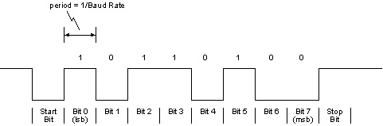
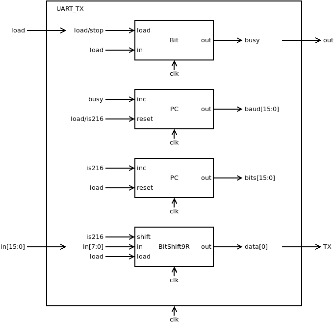
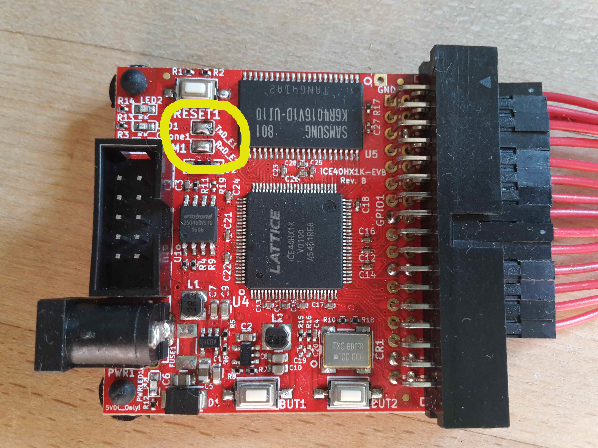
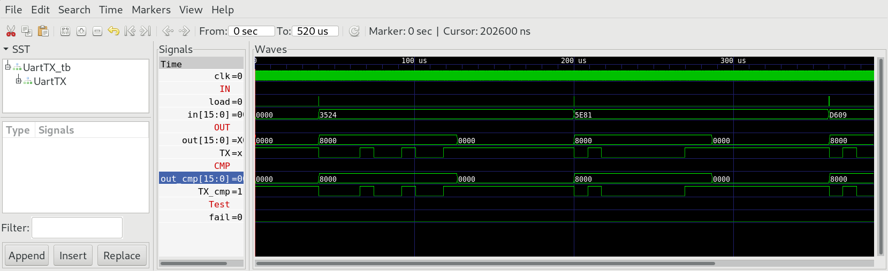
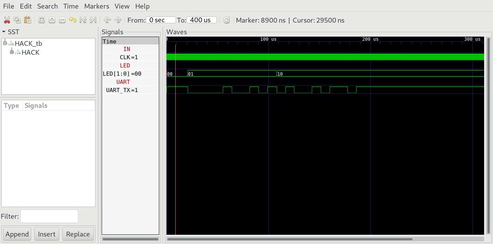

## 01 UartTX

The special function register `UartTX` mapped to memory address 4098 enables `HACK` to send chars to the outer world over UART with 115200 baud 8N1. The timing diagram for the `TX` wire should look like:



During idle `TX` line is high (logic 1). Transmission of a byte (8 bits) is initiated by the so called start bit, which always is low (logic 0), followed by the 8 data bits, starting with the least significant bit. The transmission is finished by sending the stop bit, which always is high (logic 1).
This protocol is refered as 8N1 (8 data bits, no parity bit, 1 stop bit). We use a transmission speed of 115200 baud (bits per second), meaning that each bit takes 1/115200s = 8.68μs or 217 cycles of the internal 25 MHz clock clk.

### Chip Specification

| IN/OUT | Wire      | Function                                            |
| ------ | --------- | --------------------------------------------------- |
| IN     | `clk`     | System clock (25 MHz)                               |
| IN     | `in[7:0]` | Byte to be sent                                     |
| IN     | `load`    | =1 initiates the transmission                       |
| OUT    | `out[15]` | =1 chip is busy, =0 chip is ready to send next byte |
| OUT    | `TX`      | Transmission wire                                   |

When `load=1` the chip starts serial transmission of the byte `in[7:0]` to the `TX` line according to the protocol 8N1 with 115200 baud. During transmission `out[15]` is set to high (busy). The transmission is finished after 2170 clock cycles (10 bytes at 217 cycles each). When transmission completes `out[15]` goes low again (ready).

### Proposed Implementation

Use a `Bit` to store the state (`0=ready`, `1=busy`). Use a counter `PC` to count from 0 to 216. When clocked at 25 MHz, this counter will produce the baudrate of 115200 bits per second. A second counter `PC` counts from 0 to 9 (the 10 bits to send). Finally we need a `BitShift9R`. This will be loaded with the bit pattern to be send (start bit, 8 data bits).



### memory map

The special function register `UartTX` is mapped to memory map of `HACK` according to:

| Address | I/O Device | R/W | Function                                  |
| ------- | ---------- | --- | ----------------------------------------- |
| 4098    | `UART_TX`  | R   | `out[15]=1` if busy, `out[15]=0` if ready |
| 4098    | `UART_TX`  | W   | Send char `in[7:0]` to `TX`               |

### hello.asm

To test `HACK` with `UartTX` we need a little machine language program `hello.asm`, which sends the String "Hi" to UART.

**Attention:** Use a loop to wait until UartTX is ready to send the next byte.

### UartTX on real hardware

The programmer `olimexino-32u4` can also be used as bridge to connect the PC to `iCE40HX1K-EVB` over UART. This can be done with the 10 wire UEXT cable which goes into the PGM1 connector of `iCE40HX1K-EVB`.


**Note:** To connect `RX` and `TX` lines of UEXT with iCE40 chip on `iCE40HX1K-EVB` find the solder jumper pads `RxD_E1` and `TxD_E1` near the UEXT connector (refer to [docs/iCE40HX1K-EVB](../docs/iCE40HX1K-EVB_Rev_B.pdf)) and solder them together as in the photo below. If you have a multimeter you can check for continuity with UEXT pin 3/4 for `RX`/`TX` respectively (optional).



The programmer `olimexino-32u4` works in two different modes:

* Mode 1 (yellow LED on): programmer of iCE40 board. Used with `iceprogduino`.
* Mode 2 (green LED on): UART Bridge to iCE40 chip. Use with terminal program (e.g. `tio` or `screen` on Linux).

The LED is only illuminated when a client is connected to `/dev/ttyACM0`.

To switch between the modes press the hardware button (HWB) on `olimexino-32u4`.

Now `iCE40HX1K-EVB` is connected to `RX`/`TX` of `olimexino-32u4` according to `iCE40HX1K-EVB.pcf`. (Check by comparing the schematic of `iCE40HX1K-EVB`).

```
set_io UART_RX 36    # PIO2_8/RxD connected to pin 3 of UEXT (PGM)
set_io UART_TX 37    # PIO2_9/TxD connected to pin 4 of UEXT (PGM)
```

***

### Project

* Implement `UartTX` and simulate with test bench:
  
  ```sh
  $ cd 01_UartTX
  $ apio clean
  $ apio sim
  ```

* Compare with CMP:
  
  

* Edit `HACK` and add the special function register `UartTX` to the memory address 4098.

* Implement `hello.asm` and run in simulation:
  
  ```sh
  $ cd 01_UartTX
  $ make
  $ cd ../00_HACK
  $ apio clean
  $ apio sim
  ```

* Check the `TX` wire of the simulation and look for the transmission of "Hi".
  
  

* Build and upload `HACK` with `hello.asm` in `ROM.BIN` to `iCE40HX1K-EVB`.

* Switch `olimexino-32u4` to UART bridge.

* Open terminal on your computer.

* Press `RST` button on `iCE40HX1K-EVB` and see if you can recieve "Hi" on your computer.

  ```sh
  $ cd 00_HACK
  $ apio clean
  $ apio upload
  $ tio /dev/ttyACM0
  ```

### Cleaning up the Signal

If the `TX` line is read during FGPA initialization (e.g. after reset) there is a high chance of undefined signals being interpreted as UART traffic so you may see some random bytes in addition to "Hi". The general principle for solving this is to use a control signal to indicate when transmission is valid. For `iCE40HX1K-EVB` + `olimexino-32u4` one way is to modify the Arduino sketch so it only forwards the bytes when `CDONE` is high though there are several other ways a signal could be sent via hardware or software to achieve the same effect.

The sketch at `tools/iceprogduino/iceprogduino.c` implements this filtering mechanism if you would prefer to use this over the stock sketch provided by Olimex.
