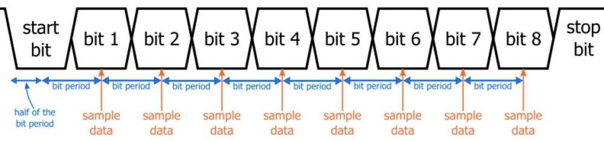
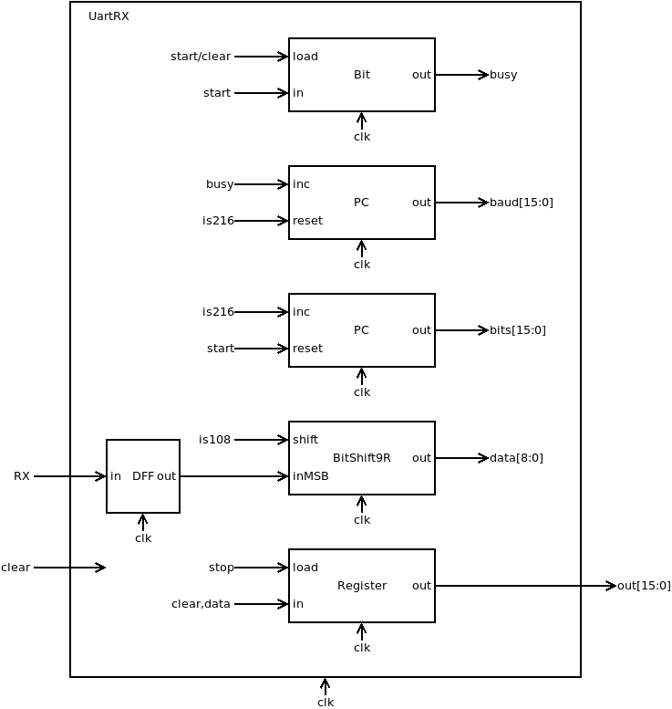
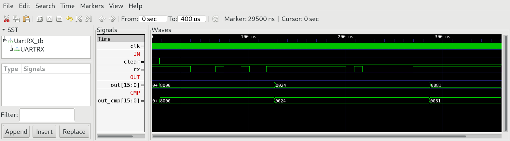
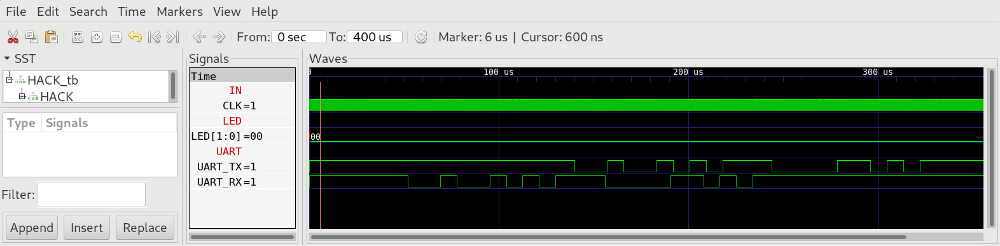

## 02 UartRX

The special function register `UartRX` receives bytes over UART with 8N1 at 115200 baud. When `RX` line goes low, the sampling process is initiated. Sampling of the individual bits is done in the middle of each bit.



### Chip Specification

| IN/OUT | Wire       | Function                                                                |
| ------ | ---------- | ----------------------------------------------------------------------- |
| IN     | `clk`      | System clock (25 MHz)                                                   |
| IN     | `clear`    | =1 clears the data register, chip is now ready to receive the next byte |
| IN     | `RX`       | Receive wire                                                            |
| OUT    | `out[15]`  | =1 waiting for next byte, =0 byte completed                             |
| OUT    | `out[7:0]` | Last received byte (when `out[15]=0`)                                   |

When `clear=1` the chip clears the data register and is ready to receive next byte. `out[15]` is set to 1 to show that chip is ready to receive next byte. When `RX` goes low the chip starts sampling the `RX` line. After reading of byte completes, chip ouputs the received byte to `out[7:0]` with `out[15]=0`. The sampling of a complete byte takes 2170 clock cycles. Sampling is done in the middle of each bit the 108th cycle.

### Proposed Implementation

Use a `Bit` to store run state: run goes high, when `RX=0` and `run=0` run stops, when last bit is received. When `run=1` a `Counter` increments every clock cycle. After 217 clock cycles the `Counter` resets. A second counter increments every 217 cycles to count the bits. At count number 108 `RX` is shifted into a `BitShift9R`. When transmission of the byte completes (10 bits sampled), the content of the shift register is loaded into the data register with `out[15]` set to 0 (valid byte). The data register can be cleared by software (clear) at any time by setting the highest bit of data register to 1 (byte not ready yet).

**Attention:** `RX` must pass a `DFF` to be registered in the clock domain of `clk`.



### Memory Map

The special function register `UartRX` is mapped to memory map of `HACK` according to:

| Address | I/O Device | R/W | Function                                                                                                   |
| ------- | ---------- | --- | ---------------------------------------------------------------------------------------------------------- |
| 4099    | `UART_RX`    | R   | When `out[15]=1` data register is not valid, when `out[15]=0` then `out[7:0]` holds the last received byte |
| 4099    | `UART_RX`    | W   | Clear data register                                                                                        |

### echo.asm

To test `HACK` with `UartRX` we need a little machine language program `echo.asm`, which reads bytes from `UartRX` and sends them to `UART_TX`.

**Attention:** Use a loop to wait until `UartRX` is ready before reading the next byte. Clear data register of `UartRX` after reading a byte.

***

### Project

* Implement `UartRX.v` and simulate with test bench:
  
  ```sh
  $ cd 02_UartRX
  $ apio clean
  $ apio sim
  ```

* Compare with `CMP`:
  
  

* Edit `HACK.v` and add special function register `UartRX` to memory address 4099.

* Implement `echo.asm` and run in simulation:
  
  ```sh
  $ cd 02_UartRX
  $ make
  $ cd ../00_HACK
  $ apio clean
  $ apio sim
  ```

* Check the `TX` wire of the simulation and compare with the received bytes at `RX`.
  
  

* Build and upload `HACK` with `echo.asm` preloaded into ROM to `iCE40HX1K-EVB`.

* Switch `olimexino-32u4` to UART bridge (yellow LED).

* Open terminal on your computer.

* Type chars in the terminal and see if they are echoed by `HACK`. `tio` doesn't echo the local input by default unless passing `-e` so any chars returned are from `HACK`.
  
  ```sh
  $ cd 00_HACK
  $ apio clean
  $ apio upload
  $ tio /dev/ttyACM0
  ```
