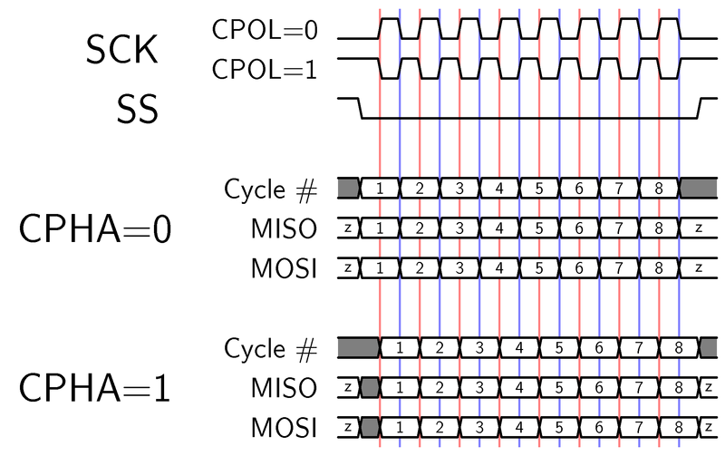
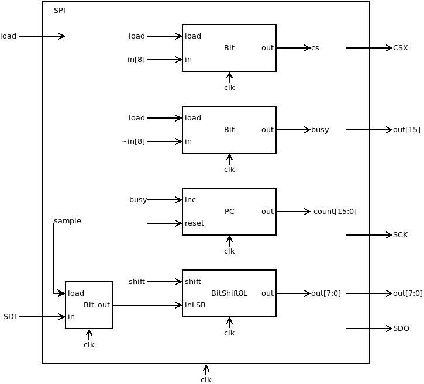
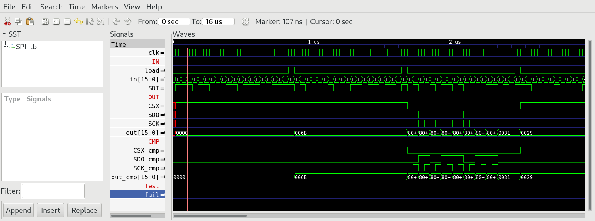
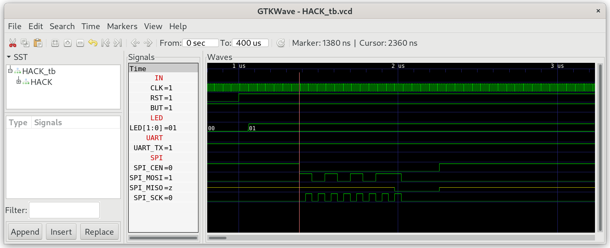
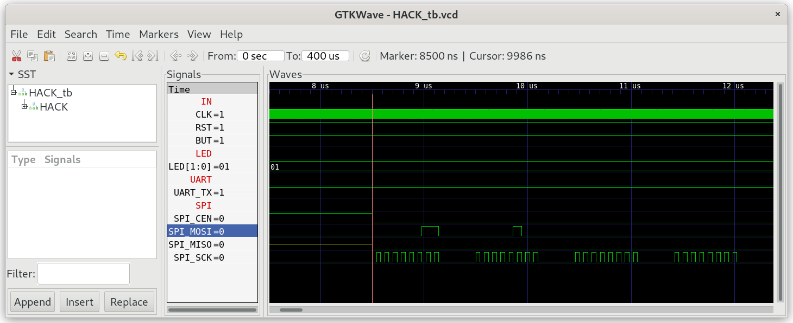
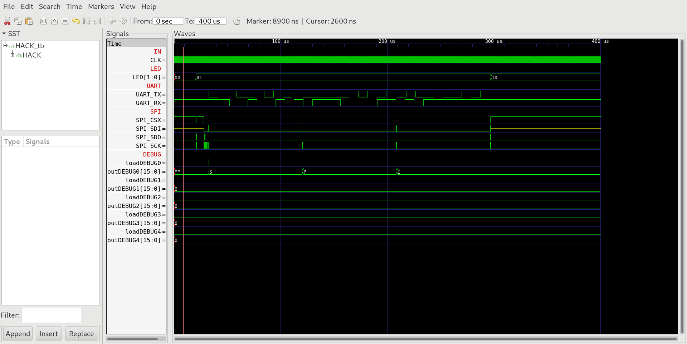

## 03 SPI

The special function register `SPI` memory mapped to address 4100 enables `HACK` to read/write bytes from the `SPI` flash memory chip `W25Q16BV` situated on `iCE40HX1K-EVB`. The timing diagram for `SPI` communication looks like the following diagram (we use `CPOL=0` and `CPHA=0`).



### Chip Specification

| IN/OUT | Wire       | Function                                                |
| ------ | ---------- | ------------------------------------------------------- |
| IN     | `clk`      | System clock (25 MHz)                                   |
| IN     | `in[7:0]`  | Byte to be sent                                         |
| IN     | `in[8]`    | =0 (and `load=1`) send byte and set `CSX` low           |
| IN     | `in[8]`    | =1 (and `load=1`) pull `CSX` high without sending byte  |
| IN     | `load`     | =1 initiates the transmission, when `in[8]=0`           |
| OUT    | `out[15]`  | =1 chip is busy, =0 chip is ready                       |
| OUT    | `out[7:0]` | Received byte (when `out[15]=0`)                        |
| OUT    | `CSX`      | `SPI` Chip Select NOT                                   |
| OUT    | `SDO`      | `SPI` Serial Data Out                                   |
| OUT    | `SCK`      | `SPI` Serial Clock                                      |
| IN     | `SDI`      | `SPI` Serial Data In                                    |

When `load=1` and `in[8]=0` transmission of byte `in[7:0]` is initiated. `CSX` goes low (and stays low even when transmission is completed). The byte is sent to `SDO` bitwise together with 8 clock signals on `SCK`. At the same time the `SPI` receives a byte at `SDI`. During transmission `out[15]=1`. After 8 clock cycles the transmission of one byte is completed. `out[15]` goes low and `SPI` outputs the received byte to `out[7:0]`.

When `load=1` and `in[8]=1` then `CSX` goes high without transmission of any bit.

**Attention:** Sampling of `SDO` is done at rising edge of `SCK` and shifting is done at falling edge of `SCK`.

### Proposed Implementation

Use a `Bit` to store the state (`0=ready`, `1=busy`) which is output to `out[15]`. Use a counter `PC` to count from 0 to 15. Finally we need a `BitShift8L`. This will be loaded with the byte `in[7:0]` to be sent.  Another `Bit` will sample the `SDI` wire when `SCK=0` and shift the stored bit into the `BitShift8L` when `SCK=1`. After 8 bits are transmitted the module clears `out[15]` and outputs the received byte to `out[7:0]`.



### Memory Map

The special function register `SPI` is mapped to memory map of `HACK` according to:

| Address | I/O Device | R/W | Function                                      |
| ------- | ---------- | --- | --------------------------------------------- |
| 4100    | `SPI`      | R   | `out[15]=1` if busy, `out[7:0]` received byte |
| 4100    | `SPI`      | W   | Start transmission of byte `in[7:0]`          |

### cat.asm

To test `HACK` with `SPI` we need a little machine language program `cat.asm`, which reads 4 consecutive bytes of `SPI` flash memory chip `W25Q16BV` of `iCE40HX1K-EVB`, starting at address `0x040000` (256K) and sends them to `UART_TX`.

According to the datasheet of `SPI` flash ROM chip `W25Q16BV` the commands needed to read the flash ROM chip are:

| Command               | Function                                                               |
| --------------------- | ---------------------------------------------------------------------- |
| `0xAB`                | Wake up from deep power down (wait 3μs) before launching next command  |
| `0x03 0x04 0x00 0x00` | Read data (command `0x03`) starting at address `0x040000` (256K)       |
| `0xB9`                | Enter deep power down mode (wait 3μs)                                  |

### SPI on real hardware

The board `iCE40HX1K-EVB` comes with a `SPI` flash ROM chip `W25Q16BV`. The chip is already connected to `iCE40HX1K` according to `iCE40HX1K-EVB.pcf` (compare with schematic [iCE40HX1K_EVB](../../docs/iCE40HX1K-EVB_Rev_B.pdf)).

```
set_io SPI_SDO 45 # iCE40-SDO
set_io SPI_SDI 46 # iCE40-SDI
set_io SPI_SCK 48 # iCE40-SCK
set_io SPI_CSX 49 # iCE40-SS_B
```

***

### Project

* Implement `SPI.v` and test with test bench:
  
  ```sh
  $ cd 03_SPI
  $ apio clean
  $ apio sim
  ```

* Compare output `OUT` of special function register `SPI` with `CMP`.
  
  

* Add special function register `SPI` to `HACK.v` at memory address 4100.

* Implement `cat.asm` and test in simulation:
  
  ```sh
  $ cd 03_SPI
  $ make
  $ cd ../00_HACK
  $ apio clean
  $ apio sim
  ```

* Check the wake up command `0xAB`:
  
  

* Check command `0x03040000` (read from address `0x040000`)
  
  

* Check reading of string "SPI!" output to `UartTX`.
  
  

* Preload the `SPI` memory chip with some text file at address `0x040000`.

* Build and upload `HACK` with `cat.asm` in `ROM.BIN` to `iCE40HX1K-EVB`.
  
  ```sh
  $ echo SPI! > spi.txt
  $ iceprogduino -o 256k -w spi.txt
  $ cd 00_HACK
  $ apio clean
  $ apio upload
  $ tio /dev/ttyACM0
  ```

* Check if you see "SPI!" in your terminal.
