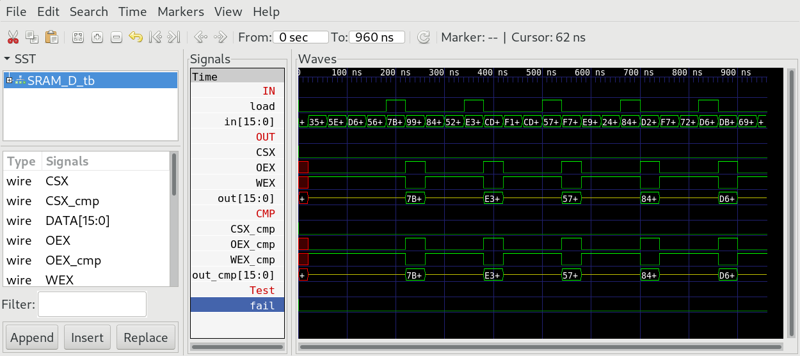
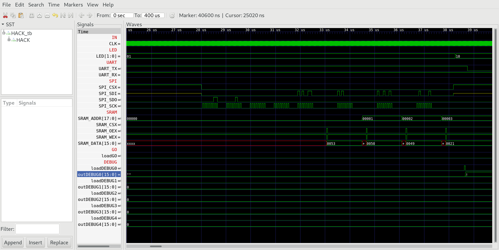
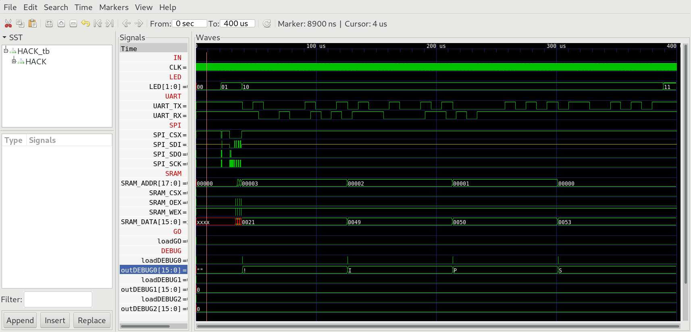

## 04 SRAM

`iCE40HX1K-EVB` includes 512KB SRAM chip `K6R4016V1D`. The SRAM chip connects to `iCE40HX1K` with 37 wires:

* `SRAM_ADDR` 18 bit
* `SRAM_DATA` 16 bit (bidirectional `InOut`)
* `SRAM_CSX` (Chip Select NOT)
* `SRAM_OEX` (Output Enable NOT)
* `SRAM_WEX` (Write Enable NOT)

To read and write to the SRAM chip we will add two special function registers to `HACK`:

* `SRAM_A` is a 16 bit register mapped at memory location 4101. `SRAM_A` controls the 16 lower bits of the 18 bit address bus. The two most significant bits are always 0, so we can only address 128KB (64K words) of SRAM memory.

* `SRAM_D` is a special function register mapped at memory location 4102. `SRAM_D` controls the bidirectional bus and the control wires `SRAM_CSX`, `SRAM_OEX` and `SRAM_WEX`.

**Note:** The 16 bit bus is bidirectional and therefore has to be connected over a tristate buffer. This is done with `InOut.v` which is considered primitive and must not be implemented.

### Chip Specification SRAM_A

`SRAM_A` is a simple `Register` that stores the lower 16 bits of the 18 bit address of the SRAM chip.

### Chip Specification SRAM_D

| IN/OUT | wire              | function                   |
| ------ | ----------------- | -------------------------- |
| IN     | `clk`             | System clock (25 MHz)      |
| IN     | `load`            | Initiate a write operation |
| IN     | `in[15:0]`        | Data to write to SRAM      |
| IN     | `mode[15:0]`      | =0 boot mode, =1 run mode  |
| OUT    | `out[15:0]`       | Data read from SRAM        |
| INOUT  | `DATA[15:0]`      | Bidirectional bus          |
| OUT    | `CSX`             | Chip Select NOT            |
| OUT    | `OEX`             | Output Enable NOT          |
| OUT    | `WEX`             | Write Enable NOT           |

When `load[t]=1` transmission of word `in[15:0]` is initiated. The word is sent to SRAM over the bidirectional wires `SRAM_DATA` and a write pulse will be triggered for one cycle at `t+1`:

* `SRAM_OEX=1`

* `SRAM_WEX=0`

When `load=0` `SRAM_DATA` will be used as input and the data of the SRAM chip will be presented at `out[15:0]`:

* `SRAM_OEX=0`

* `SRAM_WEX=1`

`SRAM_CSX` can be set to low all the time to leave the SRAM chip permanently selected.

### Proposed Implementation ADDR_A

Use a `Register` to store the lower 16 bits of `SRAM_A` (the two most significant bits are hardwired to 0).

### Proposed Implementation ADDR_D

Use a `DFF` to delay the load signal by one cycle. Use a `Register` to store the data `in[15:0]` to be stored. Use a tristate buffer `InOut.v` to control the direction of the bidirectional `SRAM_DATA` bus.

### Memory Map

The special function registers `SRAM_A` and `SRAM_D` are mapped to memory of `HACK` according to:

| Address | I/O Device | R/W | Function                         |
| ------- | ---------- | --- | -------------------------------- |
| 4101    | `SRAM_A`   | R   | Read `SRAM_A` value `[15:0]`     |
| 4101    | `SRAM_A`   | W   | Update `SRAM_A` value `[15:0]`   |
| 4102    | `SRAM_D`   | R   | Read data from `SRAM`            |
| 4102    | `SRAM_D`   | W   | Initiate a write cycle to `SRAM` |

### buffer.asm

To test `HACK` with SRAM we need a little machine language program `buffer.asm`, which reads the first four bytes of an ASCII file previosuly stored to the `SPI` flash memory chip `W25Q16BV` of `iCE40HX1K-EVB`, starting at address `0x040000` (256K) and stores the four bytes to SRAM. Finally we read the four bytes from SRAM and write them to UART.

### SRAM on real hardware

The board `iCE40HX1K-EVB` comes with a SRAM chip `K6R4016V1D`. The chip is already connected to `iCE40HX1K` according `iCE40HX1K-EVB.pcf` (Compare with schematic [iCE40HX1K_EVB](../../docs/iCE40HX1K-EVB_Rev_B.pdf)).

```
set_io SRAM_ADDR[0] 79 # SA0
set_io SRAM_ADDR[1] 80 # SA1
set_io SRAM_ADDR[2] 81 # SA2
set_io SRAM_ADDR[3] 82 # SA3
set_io SRAM_ADDR[4] 83 # SA4
set_io SRAM_ADDR[5] 85 # SA5
set_io SRAM_ADDR[6] 86 # SA6
set_io SRAM_ADDR[7] 87 # SA7
set_io SRAM_ADDR[8] 89 # SA8
set_io SRAM_ADDR[9] 90 # SA9
set_io SRAM_ADDR[10] 91 # SA10
set_io SRAM_ADDR[11] 93 # SA11
set_io SRAM_ADDR[12] 94 # SA12
set_io SRAM_ADDR[13] 95 # SA13
set_io SRAM_ADDR[14] 96 # SA14
set_io SRAM_ADDR[15] 97 # SA15
set_io SRAM_ADDR[16] 99 # SA16
set_io SRAM_ADDR[17] 100 # SA17 
set_io SRAM_CSX 78 # SRAM_#CS
set_io SRAM_OEX 74 # SRAM_#OE
set_io SRAM_WEX 73 # SRAM_#WE 
set_io SRAM_DATA[0] 62 # SD0
set_io SRAM_DATA[1] 63 # SD1
set_io SRAM_DATA[2] 64 # SD2
set_io SRAM_DATA[3] 65 # SD3
set_io SRAM_DATA[4] 66 # SD4
set_io SRAM_DATA[5] 68 # SD5
set_io SRAM_DATA[6] 69 # SD6
set_io SRAM_DATA[7] 71 # SD7
set_io SRAM_DATA[8] 72 # SD8
set_io SRAM_DATA[9] 60 # SD9
set_io SRAM_DATA[10] 59 # SD10
set_io SRAM_DATA[11] 57 # SD11
set_io SRAM_DATA[12] 56 # SD12
set_io SRAM_DATA[13] 54 # SD13
set_io SRAM_DATA[14] 53 # SD14
set_io SRAM_DATA[15] 52 # SD15
```

***

### Project

* Implement `SRAM_D.v` and simulate with test bench:
  
  ```sh
  $ cd 04_SRAM
  $ apio clean
  $ apio sim
  ```

* Compare output of your chip `OUT` with `CMP`:
  
  

* Edit `HACK.v` and add a `Register` for `SRAM_A` memory mapped to 4101.

* Edit `HACK.v` and add a special function register `SRAM_D` to memory address 4102.

* Implement `buffer.asm` and test with the test bench:
  
  ```sh
  $ cd 04_SRAM
  $ make
  $ cd ../00_HACK
  $ apio clean
  $ apio sim
  ```

* Check the SRAM wires of the simulation and look for the storing of "SPI!" (which was preloaded in `SPI` chip at memory address `0x040000` of the test bench). You can change the display format of the `SRAM_DATA` field to ASCII.
  
  

* Check the output at `UART_TX`. You should see the string "SPI!" output to `UART_TX`:
  
  

To run on real hardware:

* Preload the `SPI` memory chip with some text file at address `0x040000`.

* Build and upload `HACK` with `buffer.asm` in `ROM.BIN` to `iCE40HX1K-EVB`.

* Press `RST` button on `iCE40HX1K-EVB` and see if wou can receive the preloaded text file on your computer.
  
  ```sh
  $ echo SPI! > spi.txt
  $ iceprogduino -o 256k -w spi.txt
  $ cd 04_SRAM
  $ make
  $ cd ../00_HACK
  $ apio clean
  $ apio upload
  $ tio /dev/ttyACM0
  ```
