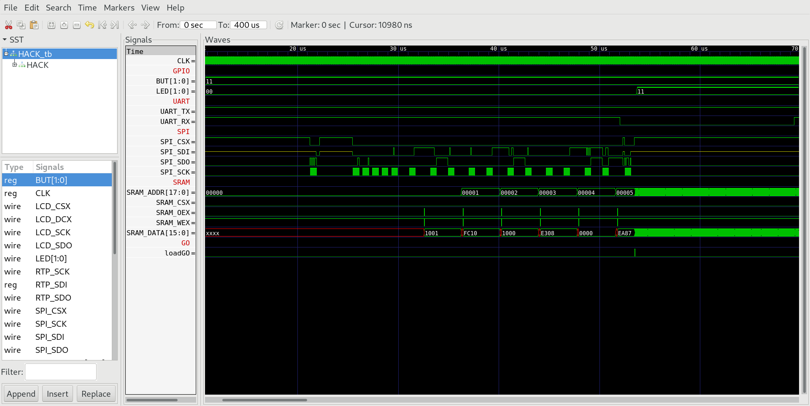

## 05 GO

The instruction memory ROM of `HACK` is limited to 512 bytes (256 words). In order to run larger programs written in Jack (e.g. Tetris) we will write the program to SRAM and use the SRAM memory chip as instruction memory. For this we need:

* A bootloader program written in assembler (which is stored in the 512 bytes of ROM), that reads a larger `HACK` binary stored on `SPI` flash ROM chip `W25Q16BV` starting at address `0x10000` and copies it to SRAM on boot.

* A multiplexer that switches where instruction memory is read from ROM to SRAM.

### Chip Specification

When `load=1` `GO` switches `HACK` operation from boot mode to run mode. In boot mode `instruction=rom_data` and `SRAM_ADDR=sram_addr_out`. In run mode `instruction=sram_data` and `SRAM_ADDR=pc`.
 
| IN/OUT | Wire            | Function                                  |
| ------ | --------------- | ----------------------------------------- |
| IN     | `clk`           | System clock (25 MHz)                     |
| IN     | `load`          | =1 initiate switch to run mode            |
| IN     | `pc`            | Program Counter (boot mode)               |
| IN     | `rom_data`      | BRAM instruction data (boot mode)         |
| IN     | `sram_addr_in`  | SRAM instruction address (run mode)       |
| IN     | `sram_data`     | SRAM instruction data (run mode)          |
| OUT    | `sram_addr_out` | BRAM/SRAM address that data was read from |
| OUT    | `instruction`   | Instruction data read from BRAM/SRAM      |
| OUT    | `out`           | =0 boot moade, =1 run mode                |

### Memory Map

The special function register `GO` is memory mapped to address 4103:

| Address | R/W | Function                                                                                                      |
| ------- | --- | ------------------------------------------------------------------------------------------------------------- |
| 4103    | W   | A write resets the `HACK` CPU and switches instrucion memory from ROM (bootloader) to SRAM (application)      |

### boot.asm

A bootloader that reads 128KB (64K words) from `SPI` flash ROM memory starting from address `0x10000` and writes them to SRAM (the first 64KB page `0x0-FFFF` is reserved for the FPGA configuration data). Finally it resets the CPU and starts program execution from SRAM.

To run the test bench initially it will only be necessary to read the first 12 bytes (6 words). The `SPI` in the test bench is preloaded with the following 6 assembler instructions of the program `leds.asm` translated into `HACK` machine language:

```
@BUT  // 0x1001
D=M   // 0xFC10
@LED  // 0x1000
M=D   // 0xE308
@0    // 0x0
0;JMP // 0xEA87
```

***

### Project

* Implement `boot.asm` (read the first 12 bytes / 6 words) and run the test bench:
  
  ```sh
  $ cd ../05_GO
  $ make
  $ cd ../00_HACK
  $ apio clean
  $ apio sim
  ```
  
  

* Check if `HACK` reads 6 instrucions from `SPI` and writes them to SRAM.

* Check if `HACK` can switch from instruction memory via ROM (bootloader) to SRAM (application) when `load=1`.

* Check if `HACK` runs `leds.asm` after switching from boot to run.

### Run on real hardware

* Preload `SPI` flash ROM with the `HACK` program `leds.asm`:
  
  ```sh
  $ cd ../../04_Machine_Language
  $ make leds
  $ make upload
  ```

* Upload `HACK` with bootloader to `iCE40HX1K-EVB`:
  
  ```sh
  $ cd ../06_IO_Devices/05_GO
  $ make
  $ cd ../00_HACK
  $ apio clean
  $ apio upload
  ```

* Check if `iCE40HX1K-EVB` runs the bootloader, which loads `leds.asm` from `SPI` and starts execution of `leds.asm`.

* If `leds.asm` is working extend `boot.asm` to load 128KB (64K words) from `SPI` flash memory to SRAM.

* You are now ready to start implementing the operating system Jack OS. Proceed to project `07_Operating_System` and come back later to implement the last I/O devices `LCD` and `RTP` to connect the screen with touch panel `MOD-LCD2.8RTP`.