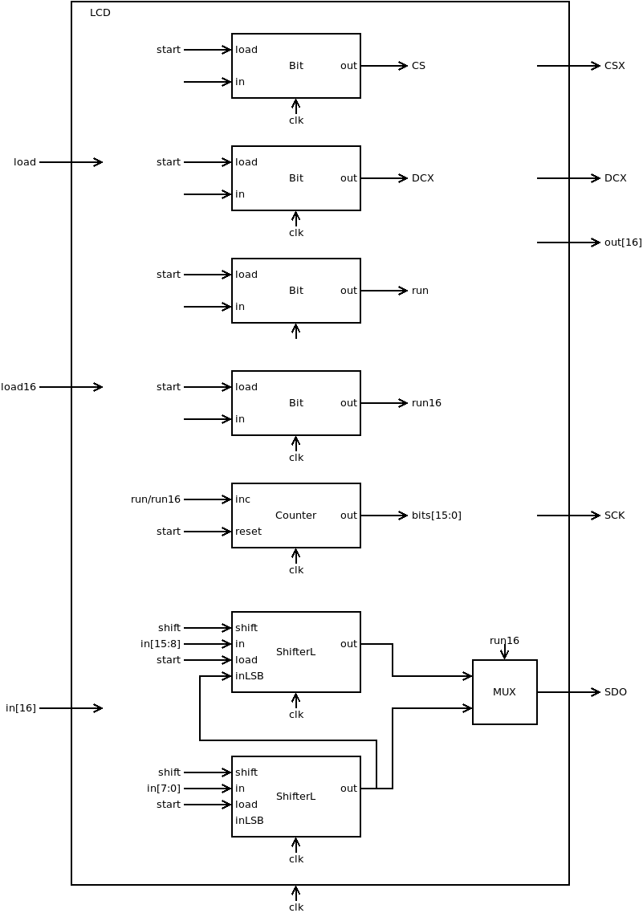
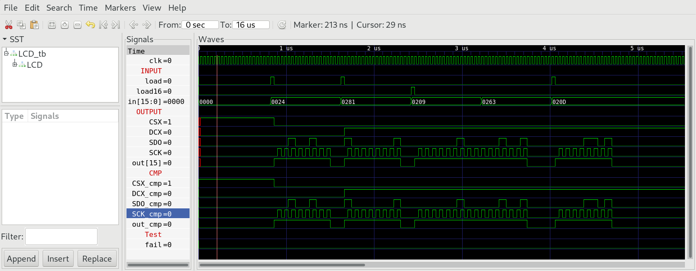

## 06 LCD

The special function register `LCD`  memory mapped to addresses 4104 and 4105 enables `HACK` to write bytes to the `LCD` controller chip `ILI9341V` situated on `MOD-LCD2.8RTP`. The communication protocol is `SPI` with one additional wire `DCX`. The protocol defines transmission of 8 bit commands with `DCX=0` followed by data with `DCX=1`. Data packets can have any length depending on the launched command but will be batched into either 8 or 16 bit cycles in our controller.

### Chip Specification

| IN/OUT | wire      | function                                             |
| ------ | --------- | ---------------------------------------------------- |
| IN     | `clk`     | System clock (25 MHz)                                |
| IN     | `in[7:0]` | Byte to be sent                                      |
| IN     | `in[8]`   | =0 send byte and set `CSX` low                       |
| IN     | `in[8]`   | =1 pull `CSX` high without sending byte              |
| IN     | `in[9]`   | Value of `DCX` when transmitting a byte              |
| IN     | `load`    | Initiates the transmission of a byte when `in[8]=0`  |
| IN     | `load16`  | Initiates the transmission of `bit in[15:0]`         |
| OUT    | `out[15]` | =0 chip is busy, =0 ready                            |
| OUT    | `DCX`     | `SPI` Data/Command, =0 command, =1 data              |
| OUT    | `SDO`     | `SPI` Serial Data Out                                |
| OUT    | `SCK`     | `SPI` Serial Clock                                   |
| OUT    | `CSX`     | `SPI` Chip Select NOT                                |

The special function register `LCD` communicates with `ILI9341V` `LCD` controller over 4 wire `SPI`.

When `load=1` and `in[8]=0` transmission of byte `in[7:0]` is initiated. `CSX` goes low (and stays low even when transmission is completed). `DCX` is set to `in[9]`. The byte `in[7:0]` is sent to `SDO` bitwise together with 8 clock signals on `SCK`. During transmission `out[15]=1` and after 16 clock cycles transmission is completed and `out[15]=0`.

When `load=1` and `in[8]=1` `CSX` goes high and `DCX=in[9]` without transmission of any bit.

When `load16=1` transmission of word `in[15:0]` is initiated. `CSX` is goes low (and stays low even when transmission is completed). `DCX` is set to 1 (data). After 32 clock cycles transmission is completed and `out[15]=0`.

### Proposed Implementation

Use a `Bit` to store the state (`0=ready`, `1=busy`) which is emitted to `out[15]`. Another two `Bit` store the state of `DCX` and `CSX`. Use a counter `PC` to count from 0 to 15 or 31 according to `load/load16`. Finally we need two connected `BitShift8L`. They will be loaded with the byte `in[7:0]` or the word `in[15:0]` to be sent. After 8/16 bits are transmitted the module clears `out[15]`.



### Memory Map

The special function register `LCD` is mapped to memory map of `HACK` according to:

| address   | I/O device | R/W | function                              |
| --------- | ---------- | --- | ------------------------------------- |
| 4104      | `LCD8`     | W   | Start transmittion of byte `in[7:0]`  |
| 4105      | `LCD16`    | W   | Start transmittion of word `in[15:0]` |
| 4104/4105 | `LCD8/16`  | R   | `out[15]=1` busy, `out[15]=0` idle    |

### LCD on real hardware

The board `MOD-LCD2.8RTP` comes with a 2.8 inch `LCD` screen controlled by a controller chip `ILI8341V`. `MOD-LCD2.8RTP` must be connected to `iCE40HX1K-EVB` with 6 jumper wire cables: `+3.3V`, `GND` plus 4 data wires according to `iCE40HX1K-EVB.pcf` (Compare with schematic [iCE40HX1K_EVB](../../docs/iCE40HX1K-EVB_Rev_B.pdf) and [MOD-LCD2.8RTP_RevB.pdf](../../docs/MOD-LCD2.8RTP_RevB.pdf)).

```
set_io LCD_DCX 1        # PIO3_1A connected to pin 5 of GPIO1
set_io LCD_SDO 2        # PIO3_1B connected to pin 7 of GPIO1
set_io LCD_SCK 3        # PIO3_2A connected to pin 9 of GPIO1
set_io LCD_CSX 4        # PIO3_2B connected to pin 11 of GPIO1
```

| Wire      | `iCE40HX1K-EVB` (GPIO1) | `MOD-LCD2.8RTP` (UEXT) |
| --------- | ----------------------- | ---------------------- |
| `+3.3V`   | 3                       | 1 `+3.3V`              |
| `GND`     | 4                       | 2 `GND`                |
| `LCD_DCX` | 5                       | 7 `D/C`                |
| `LCD_SDO` | 7                       | 8 `MOSI`               |
| `LCD_SCK` | 9                       | 9 `SCK`                |
| `LCD_CSX` | 11                      | 10 `CS`                |

***

### Project

* Implement `LCD.v` and test with test bench:
  
  ```sh
  $ cd 06_LCD
  $ apio clean
  $ apio sim
  ```

* Compare output `OUT` of special chip `LCD` with `CMP`.
  
  

* Add special function register `LCD` to `HACK` at memory addresses 4104/4105 and upload to `iCE40HX1K-EVB` with the bootloader `boot.asm` preloaded into ROM (this is to validate the build, no change from last uploaded boot/application code):
  
  ```sh
  $ cd ../05_GO
  $ make
  $ cd ../00_HACK
  $ apio clean
  $ apio upload
  ```

* Proceed to `07_Operating_System` and implement the driver class `Screen.jack` that sends command over `LCD` the controller chip `ILI9341V` on `MOD-LCD2.8RTP`.
