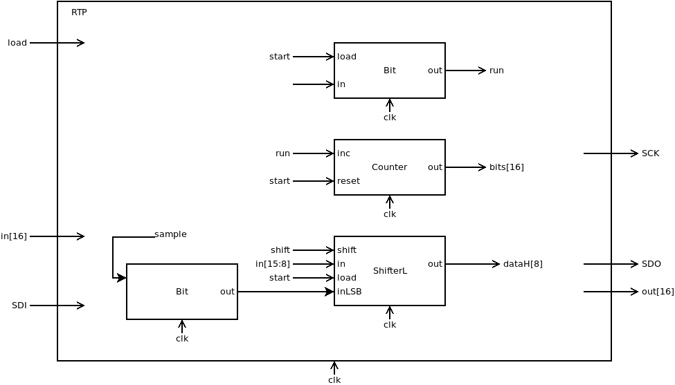
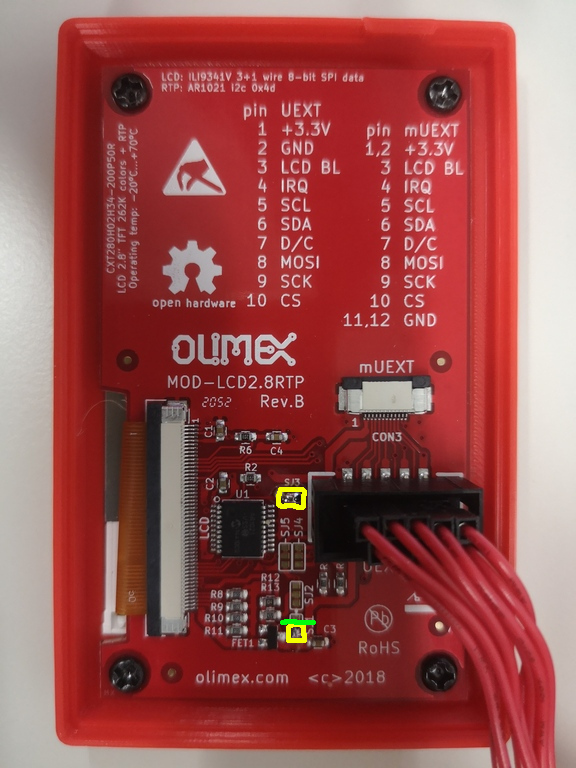
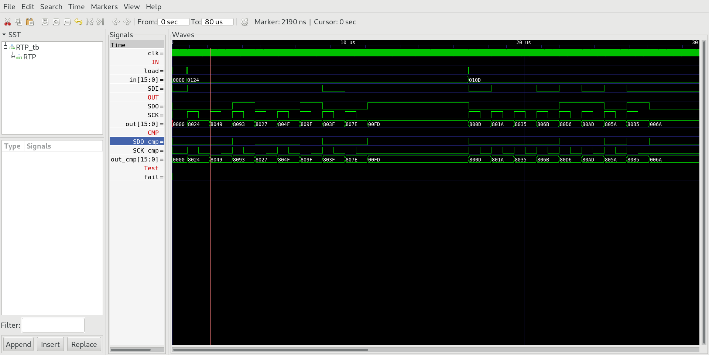

## 07 RTP (AR1021)

Ensure you actually have the `AR1021` chip installed in `U1` before proceeding, refer to the `RTP` section in [06_IO_Devices](../Readme.md).

### Protocol Selection

The special function register `RTP` memory mapped to address 4106 enables `HACK` to read bytes from the touch panel controller `AR1021` on `MOD-LCD2.8RTP` which supports both `SPI` and `I2C` protocols for communication. The former is simpler to implement but requires a hardware modification to enable, see `07B_RTP_NS2009` for notes on `I2C` implementation. `SPI` will be used in the proposed implementation in this instance.

**Attention:** The specification of `AR1021` requires that `SCK` is inverted (compare [03_SPI/Readme.md](../03_SPI/Readme.md) with `CPOL=1`) and a slower transfer rate of max ~900 KHz.

### Chip Specification

| IN/OUT | Wire       | Function                      |
| ------ | ---------- | ----------------------------- |
| IN     | `clk`      | System clock (25 MHz)         |
| IN     | `in[7:0]`  | Byte to be sent               |
| IN     | `load`     | =1 initiates the transmission |
| OUT    | `out[15]`  | =0 chip is busy, =0 ready     |
| OUT    | `out[7:0]` | Received byte                 |
| IN     | `SDI`      | `SPI` Serial Data In          |
| OUT    | `SDO`      | `SPI` Serial Data Out         |
| OUT    | `SCK`      | `SPI` Serial Clock            |

When `load=1` transmission of byte `in[7:0]` is initiated. The byte is sent to `SDO` bitwise together with 8 clock signals on `SCK`. At the same time `RTP` receives a byte at `SDI` and during transmission `out[15]=1`. The transmission of a byte takes 256 clock cycles where every 32 clock cycles one bit is shifted out. In the middle of each bit at counter number 15 the bit `SDI` is sampled. When transmission is completed `out[15]=0` and `RTP` outputs the received byte to `out[7:0]`.

### Proposed Implementation

Use a `Bit` to store the state (`0=ready`, `1=busy`) which is emitted to `out[15]`. Use a counter `PC` that counts from 0 to 511. Finally we need a `BitShift8L` that will be loaded with the byte `in[7:0]` to be sent.  Use a `Bit` to sample the `SDI` line. After 8 bits are transmitted/received `RTP` clears `out[15]` and outputs the received byte to `out[7:0]`.

**Attention:** Sample on falling edge of `SCK` and shift on rising edge of `SCK`.



### Memory Map

The special function register `RTP` is mapped to memory map of `HACK` according to:

| Address | I/O Device | R/W | Function                                                          |
| ------- | ---------- | --- | ----------------------------------------------------------------- |
| 4106    | `RTP`      | W   | Start transmission of byte `in[7:0]`                              |
| 4106    | `RTP`      | R   | `out[15]=1` busy, `out[15]=0` idle, `out[7:0]` last received byte |

### RTP on real hardware

`MOD-LCD2.8RTP` comes with a touch panel controlled by `AR1021`. `MOD-LCD2.8RTP` must be connected to `iCE40HX1K-EVB` with 3 more jumper wire cables according to `iCE40HX1K-EVB.pcf` (Compare with schematic [iCE40HX1K_EVB](../../docs/iCE40HX1K-EVB_Rev_B.pdf) and [MOD-LCD2.8RTP_RevB.pdf](../../docs/MOD-LCD2.8RTP_RevB.pdf)).

```
set_io RTP_SDI 7        # PIO3_3A connected to pin 13 of GPIO1
set_io RTP_SDO 8        # PIO3_3B connected to pin 15 of GPIO1
set_io RTP_SCK 9        # PIO3_5A connected to pin 17 of GPIO1
```

| Wire      | `iCE40HX1K-EVB` (GPIO1) | `MOD-LCD2.8RTP` (UEXT)                 |
| --------- | ----------------------- | -------------------------------------- |
| `+3.3V`   | 3                       | `+3.3V`                                |
| `GND`     | 4                       | 2 `GND`                                |
| `LCD_DCX` | 5                       | 7 `D/C`                                |
| `LCD_SDO` | 7                       | 8 `MOSI`                               |
| `LCD_SCK` | 9                       | 9 `SCK`                                |
| `LCD_CSX` | 11                      | 10 `CS`                                |
| `RTP_SDI` | 13 (29)                 | 4 `IRQ/SDO` (with solder jumper `SJ3`) |
| `RTP_SDO` | 15 (31)                 | 6 `SDA`                                |
| `RTP_SCK` | 17 (33)                 | 5 `SCL`                                |

**Attention:** To enable `SPI` communication on the `RTP` controller chip `AR1021` we must modify two solder jumpers. (Compare with schematic of `MOD-LCD2.8RTP` together with datasheet of `AR1021`). The latest iteration of `MOD-LCD2.8RTP` is `Rev D` which has a different layout than pictured (`Rev B`) but the same modifications apply.

* Cut connection `SJ1-GND` with a sharp knife (green). A craft knife, scalpel or similar should do - be very careful not to sever any other traces!
  * Optional: If you have a multimeter check that continuity is broken between `SJ1-GND` and `SJ1-2` (can also check for continuity with UEXT pin 2 for ground).
  * Alternatively if you're not confident doing this then you can implement `I2C` instead of `SPI` for the `RTP` controller but this is an exercise left to the reader. See `AR1021` [datasheet](../../docs/AR1000.pdf) for implementation details.

* Connect `M1` to `VDD` (`+3.3V`) by soldering `SJ1-VDD` to activate `SPI` mode of `AR1021` (yellow).
  * After the cut + solder on `SJ1` the `M1` pin on `AR1021` should now be powered instead of being drained to ground.
  * Optional: check for continuity between `SJ1` and UEXT pin 1 for `VDD` (while powered off) then check for ~3.3V on `M1` and `SJ1`.

* Connect UEXT pin 4 (`IRQ/SDO`) by soldering `SJ3` (yellow).
  * Optional: check for continuity between `SJ3` and UEXT pin 4.



***

### Project

* Implement special function register `RTP` and test with test bench:
  
  ```sh
  $ cd 07_RTP
  $ apio clean
  $ apio sim
  ```

* Compare output `OUT` of special chip `RTP` with `CMP`.
  
  

* Add special function register `RTP` to `HACK` at memory addresses 4106 and upload to `iCE40HX1K-EVB` with bootloader `boot.asm` preloaded into ROM (build test only, no test bench data for `RTP`).
  
  ```sh
  $ cd ../05_GO
  $ make
  $ cd ../00_HACK
  $ apio clean
  $ apio upload
  ```

* Proceed to `07_Operating_System` and implement the driver class `Touch.jack` that sends command over `RTP` the controller chip `AR1021` on `MOD-LCD2.8RTP`.
