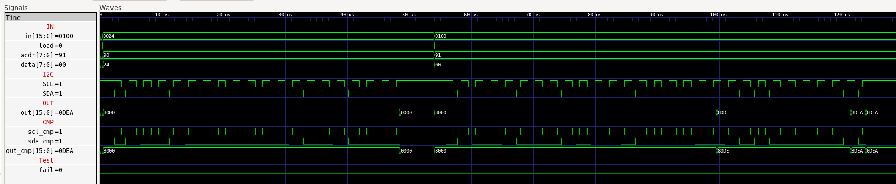

## 07 RTP (NS2009)

Ensure you actually have the `NS2009` chip installed in `U2` before proceeding, refer to the `RTP` section in [06_IO_Devices](../Readme.md).

### Communication Protocol

The special function register `RTP` memory mapped to address 4106 enables `HACK` to read bytes from the touch panel controller `NS2009` on `MOD-LCD2.8RTP`. Unlike `AR1021` it only supports `I2C` as the communication protocol. `I2C` uses half-duplex data (`SDA`) and clock (`SCL`) lines which are shared between master (`iCE40HX1K`) and slave (`NS2009`), i.e. both lines are be controlled by either device but only one can be actively transmitting at a time. 

To achieve this `MOD-LCD2.8RTP` provides pull-up resistors on the `SDA` and `SCL` lines which allows for an open-drain circuit design: when the line is not being actively driven (high impedence) it will be pulled high by the resistor and either device can drive the line low by draining the circuit. In our implementation this is handled with an 1 bit `inout` primitive for `SDA` and `SCL`, do not use the previously implemented `InOut` part used for `SRAM` which is 16 bit.

**Note:** Because of the shared nature of the wires `I2C` timing is more complicated than previously implemented protocols, it is recommended to read the following sections in conjunction with the NS2009 [datasheet](../../docs/NS2009.pdf) & the I2C [timing diagram](https://en.wikipedia.org/wiki/I2C#Timing_diagram) on Wikipedia.

### Chip Specification

| IN/OUT | Wire        | Function                               |
| ------ | ----------- | -------------------------------------- |
| IN     | `clk`       | System clock (25 MHz)                  |
| IN     | `load`      | =1 initiates the transaction           |
| IN     | `in[8]`     | =0 write, =1 read                      |
| IN     | `in[7:0]`   | Command to be sent (if write)          |
| INOUT  | `SCL`       | `I2C` Serial Clock (shared)            |
| INOUT  | `SDA`       | `I2C` Serial Data line (shared)        |
| OUT    | `out[15]`   | =0 chip is busy, =0 ready              |
| OUT    | `out[11:0]` | Received bytes (if read)               |

When `load=1` a new transaction is initiated where `in[8]` determines whether it is a read or write operation. In both cases the first parameter in the transaction is the fixed 7 bit device address for `NS2009` (`0x48`) followed by a single read/write bit (resulting in `0x91`/`0x90` respectively).

For a write operation this will be followed by a byte of command data sent from master to slave, for a read operation this will be two bytes of touch event data being returned from slave to master however only the 12 most significant bits contain touch data and will be shifted right into the least significant bits of `out[11:0]` on completion.

Each byte being sent/received is sent to `SDA` bitwise together with 8 clock signals on `SCL`. Each transaction is preceded by a `START` signal where `SDA` drops low while `SCL` remains high and then an `ACK` signal after each byte where `SDA` is driven low for one `SCL` pulse. A transaction comprised of multiple bytes can shift continuously while only being punctuated by the respective `ACK` for each byte.

The slave is responsible for sending the `ACK` signal in response to the address byte and command byte for write operations. The master is responsible for sending an `ACK` signal after receiving the first byte of a read operation and `NACK` after the second.

The end of a data packet is terminated by a `NACK` signal where `SDA` is instead driven high for one `SCL` pulse and then the overall transmission is concluded with a `STOP` signal where `SCL` goes high followed by `SDA` going high.

### Proposed Implementation

The proposed implementation uses a Finite State Machine (FSM) which in Verilog is implemented as a series of nested `case` statements in a clock driven behavioural block broken up into `states` which can be further sub-divided up into multiple `phases` and the progression through the FSM is stored in registers.

States are blocks of common activities such as:

* `IDLE`: Reset counters & registers to their defaults, ready to initiate a new transaction.
* `START_COND`: Send the `START` signal.
* `SEND_ADDR`: Send the device address & read/write bit.
* `WRITE_BYTE`: Send a command byte.
* `READ_BYTE`: Receive the touch event bytes and shift them into `out[11:0]`.
* `END_COND`: Send the `END` signal.

For these state based signals to be unambiguous there needs to be a minimum time delay between `SDA` and `SCL` transitions. As all but the `IDLE` state require interacting with both wires it is recommended to allow for 4 phases per state with the duration of each phase being set to a stable `tick` rate derived from the system clock divided by the intended `I2C` baud rate (400 KHz) multiplied by the total number of phases:

```
// 400 KHz SCL further divided by 2 tick/tock x 2 sub-phases per high/low
localparam integer DIVIDER = 25_000_000 / (400_000 * 2 * 2);
```

Updates to `SDA` must be shifted in while `SCL` is low and `SDA` can be sampled when `SCL` is high. `SDA` and `SCL` can be driven low when necessary but must be set to high impedence (`z`) to let the pull-up resistor draw the line high rather than actively driving it high.

### Memory Map

The special function register `RTP` is mapped to memory map of `HACK` according to:

| Address | I/O Device | R/W | Function                                                           |
| ------- | ---------- | --- | ------------------------------------------------------------------ |
| 4106    | `RTP`      | W   | Start transmission (read/write transaction)                        |
| 4106    | `RTP`      | R   | `out[15]=1` busy, `out[15]=0` idle, `out[11:0]` last received bits |

### RTP on real hardware

`MOD-LCD2.8RTP` comes with a touch panel controlled by `NS2009`. `MOD-LCD2.8RTP` must be connected to `iCE40HX1K-EVB` with 2 more jumper wire cables according to `iCE40HX1K-EVB.pcf` (Compare with schematic [iCE40HX1K_EVB](../../docs/iCE40HX1K-EVB_Rev_B.pdf) and [MOD-LCD2.8RTP_RevB.pdf](../../docs/MOD-LCD2.8RTP_RevB.pdf)).

```
set_io RTP_SDA 20  # PIO3_10A connected to pin 31 of GPIO1, pin 6 SDA on MOD-LCD2.8RTP
set_io RTP_SCL 21  # PIO3_10B connected to pin 33 of GPIO1, pin 5 SCL on MOD-LCD2.8RTP
```

| Wire      | `iCE40HX1K-EVB` (GPIO1) | `MOD-LCD2.8RTP` (UEXT)                 |
| --------- | ----------------------- | -------------------------------------- |
| `+3.3V`   | 3                       | `+3.3V`                                |
| `GND`     | 4                       | 2 `GND`                                |
| `LCD_DCX` | 5                       | 7 `D/C`                                |
| `LCD_SDO` | 7                       | 8 `MOSI`                               |
| `LCD_SCK` | 9                       | 9 `SCK`                                |
| `LCD_CSX` | 11                      | 10 `CS`                                |
| `RTP_SDA` | 15 (31)                 | 6 `SDA`                                |
| `RTP_SCL` | 17 (33)                 | 5 `SCL`                                |

Unlike `AR1021` no other hardware changes are required to support this configuration.

***

### Project

* Implement special function register `RTP` and test with test bench:
  
  ```sh
  $ cd 07_RTP
  $ apio clean
  $ apio sim
  ```

* Compare output `OUT` of `RTP` with `CMP`:
  
  

* Add special function register `RTP` to `HACK` at memory addresses 4106 and upload to `iCE40HX1K-EVB` with bootloader `boot.asm` preloaded into ROM (build/pnr test only, no test bench data for `RTP`):
  
  ```sh
  $ cd ../05_GO
  $ make
  $ cd ../00_HACK
  $ apio clean
  $ apio upload
  ```

* Proceed to `07_Operating_System` and implement the driver `Touch.jack` that sends commands via `RTP` to `NS2009` on `MOD-LCD2.8RTP`.