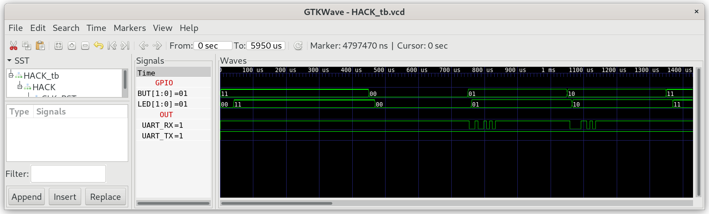

## GPIO.jack

This library provides access to `BUT` and `LED`.

### GPIO_Test

In the Testfolder `01_GPIO_Test` you find a minimal version of `Sys.jack` containing the init function `Sys.init()`, which is called after starting Jack OS. `Sys.init()` is the Jack OS version of `leds.asm`, which reads the `BUT` and writes the values to `LED` in an endless loop:

```
class Sys {

    function void init() {
        do GPIO.init();
        while (true) {
            do GPIO.writeLed(GPIO.readBut());
        }        
        return;
    }
}
```

***

### Project

* Implement `GPIO.jack`

* Test in simulation:
  
  ```sh
  $ cd 01_GPIO_Test
  $ make
  $ cd ../00_HACK
  $ apio clean
  $ apio sim
  ```
  
  The test bench will simulate the pushing of `BUT1/2`. Check if the `LED` change accordingly.
  
  


* Run on real hardware with `HACK`, build and upload `GPIO_Test` to `iCE40HX1K-EVB`:

  First prepare the bootloader and any hardware updates. In future tests this will be considered implicit and doesn't need to be repeated unless there are changes to either.
  
  ```sh
  $ cd ../../06_IO_Devices/05_GO
  $ make
  $ cd ../00_HACK
  $ apio clean
  $ apio upload
  ```

  Then compile & upload the test application:

  ```sh
  $ cd ../../07_Operating_System/01_GPIO_Test
  $ make
  $ make upload
  ```

* Push buttons `BUT1/2` on `iCE40HX1K-EVB` and check the `LED`.