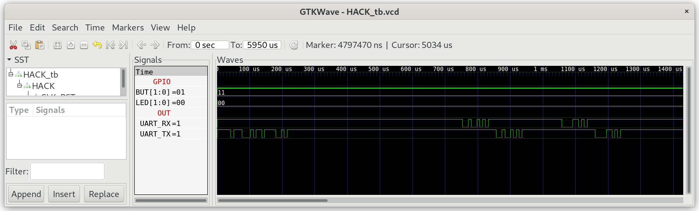

## UART.jack

Library that provides character based access to `UART_TX` and `UART_RX`.

### UART_Test

In the Testfolder `02_UART_Test` you find a minimal version of `Sys.jack` containing the init function `Sys.init()`, which is called after starting Jack OS. `Sys.init()` is the Jack OS version of `echo.asm`, which reads the bytes received at `UART_RX` and writes the values to `UART_TX` in an endless loop:

```
class Sys {

    function void init() {
        do UART.init();
        while (true) {
            do UART.write(UART.read());
        }        
        return;
    }
}
```

***

### Project

* Implement `UART.jack`

* Test in simulation:
  
  ```sh
  $ cd 02_UART_Test
  $ make
  $ cd ../00_HACK
  $ apio clean
  $ apio sim
  ```
  
  The test bench will simulate the transmission of `RX` to `UART_RX`. Check if `HACK` echoes to `UART_TX`.
  
  

* Run on real hardware with `HACK`, build and upload `UART_Test` to `iCE40HX1K-EVB` with:
  
  ```sh
  $ ../02_UART_Test
  $ make
  $ make upload
  ```

* Connect `HACK` with your computer over UART, open a terminal program and type some chars. Check if `HACK` can echo them:
  
  ```sh
  $ tio /dev/ttyACM0
  ```
