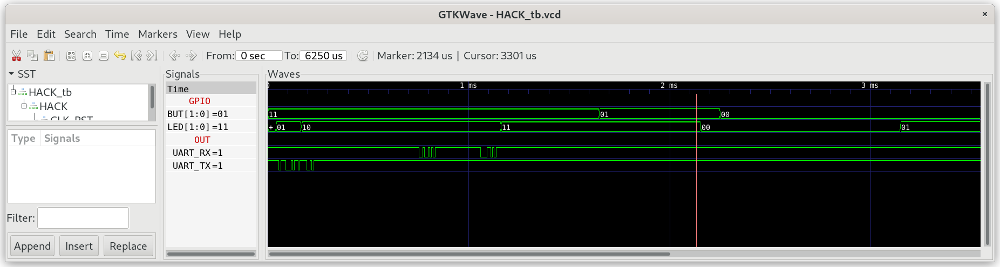

## Sys.jack

A library that supports various program execution services.

**Hint:** To debug the next projects on real hardware, we can implement one or both of the following strategies into `Sys.jack`.

* Use `LED` to indicate the state of Jack OS according to:

| `LED[1:0]` | `Sys.jack`       | Jack OS state                        |
| ---------- | ---------------- | ------------------------------------ |
| 00         | At entry         | Nothing happened yet                 |
| 01         | `Sys.init()`     | Start execution of `Main.main()`     |
| 10         | `Sys.halt()`     | `Main.main()` terminated succesfully |
| 11         | `Sys.error(int)` | System error occurred                |

* We can use `UART` to send some chars according to the state of Jack OS. e.g. send "GO" at `Sys.init()`, "HALT" at `Sys.halt()` and "ERR" at `Sys.error(int)`.

***

### Project

* Implement `Sys.jack`.

  **Attention:** Don't init the other Jack libraries in `Sys.init()` beyond what is included in this folder (`GPIO`, `UART`).

* Test in simulation. Change the delay time in `Main.jack` to 1ms.
  
  ```sh
  $ cd 03_Sys_Test
  $ make
  $ cd ../00_HACK
  $ apio clean
  $ apio sim
  ```

* Check, if the `LED` toggles every 1ms:
  
  

### Run on real hardware

* Set the delay to 1000ms with `Sys.wait(1000)` in `Main.main()`:
  
  ```sh
  $ cd 03_Sys_Test
  $ make
  $ make upload
  ```

* Check if the `LED` changes state every 1 second.