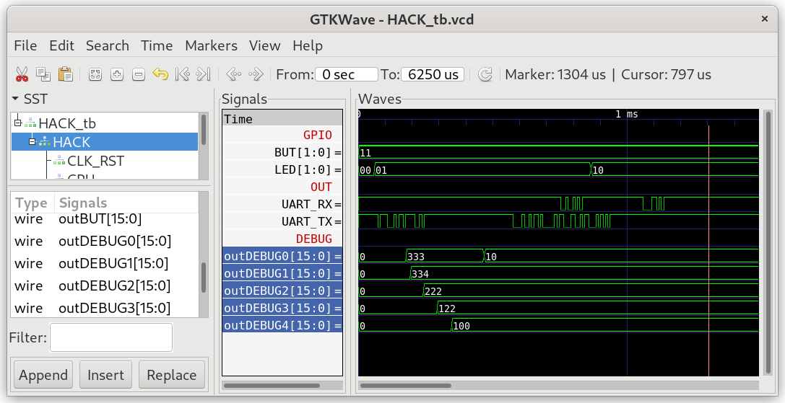

## Memory.jack

This library provides two services: direct access to the computer's main memory (RAM) and allocation and recycling of memory blocks. The `HACK` RAM consists of 7KB (3584 words) each holding 16 bits of data.

The heap starts at address 1024 with `do Memory.init()` in the `Sys.init()`. This will leave 1.5KB (768 words) of stack, enough to run Tetris.

| Address   | Segment                                     |
| --------- | ------------------------------------------- |
| 0-15      | R0-R15 (`SP`, `LCL`, `ARG`, `THIS`, `THAT`) |
| 16-255    | Static                                      |
| 256-1023  | Stack                                       |
| 1024-3583 | Heap                                        |
| 4096-4111 | I/O devices                                 |

***

### Project

* Implement `Memory.jack`.

  **Attention:** Don't init the other Jack libraries in `Sys.init()` beyond what is included in this folder (`GPIO`, `UART`, `Memory`).

* Test in simulation:
  
  ```sh
  $ cd 04_Memory_Test
  $ make
  $ cd ../00_HACK
  $ apio clean
  $ apio sim
  ```

* Check the content of special function register `DEBUG0-4`:
  
  
