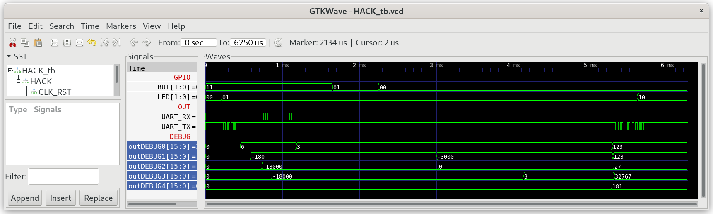

## Math_Test

A library of commonly used mathematical functions.

**Note:** Jack compilers implement multiplication and division using OS method calls.

***

### Project

* Implement `Math.jack`.

  **Attention:** Don't init the other Jack libraries in `Sys.init()` beyond what is included in this folder (`GPIO`, `UART`, `Memory`, `Math`).

* Test in simulation:
  
  ```sh
  $ cd 06_Math_Test
  $ make
  $ cd ../00_HACK
  $ apio clean
  $ apio sim
  ```

* Compare the content of special function register `DEBUG0-4`.
  
