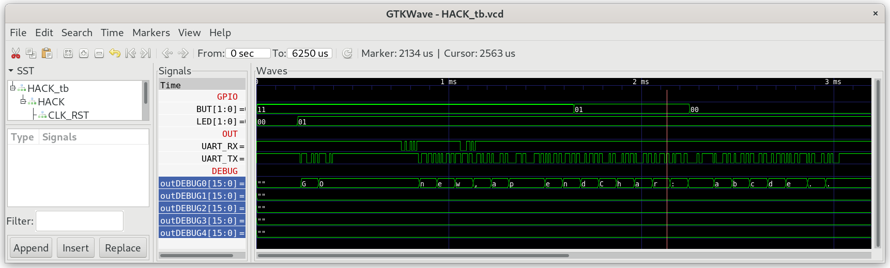

## String.jack

Represents character strings. In addition for constructing and disposing strings, the class features methods for getting and setting individual characters of the string, for erasing the string's last character, for appending a character to the string's end, and more typical string operations.

***

### Project

* Implement `String.jack` and at least the function `StdIO.printString(String s)`.

  **Attention:** Don't init the other Jack libraries in `Sys.init()` beyond what is included in this folder (`GPIO`, `UART`, `Memory`, `Math`).

* Test by running `String_Test` in simulation, which performs several String operation and outputs them to `StdIO` (`UART`).
  
  **Hint:** Optionally use `DEBUG0` register to show which characters are transmitted over `UartTX`. Add the following code in function `UART.writeChar()`:
  
  ```
  do Memory.poke(4107,data);
  ```
 
  ```sh
  $ cd 07_String_Test
  $ make
  $ cd ../00_HACK
  $ apio clean
  $ apio sim
  ```
  
  

* Run `String_Test` on real hardware on `iCE40HX1K-EVB` using a terminal program connected to `UART`.

  ```sh
  $ cd 07_String_Test
  $ make
  $ make upload
  $ tio /dev/ttyACM0
  ```

* Compare your terminal output with:
  
  ```
  new,appendChar: abcde -- expected: abcde
  setInt: 12345 -- expected: 12345
  setInt: -32767 -- expected: -32767
  length: 5 -- expected: 5
  charAt[2]: 99 -- expected: 99
  setCharAt(2,'-'): ab-de -- expected: ab-de
  eraseLastChar: ab-d -- expected: ab-d
  intValue: 456 -- expected: 456
  intValue: -32123 -- expected: -32123
  backSpace: 129 -- expected: 129
  doubleQuote: 34 -- expected: 34
  newLine: 128 -- expected: 128
  ```