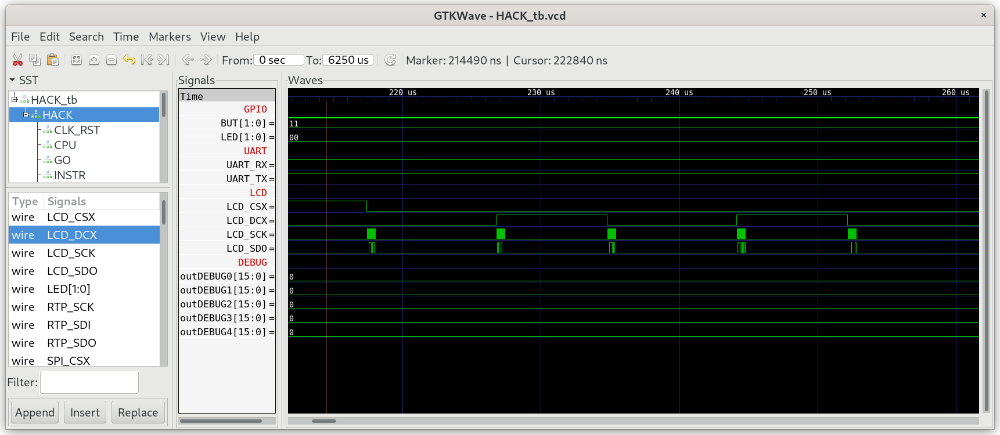
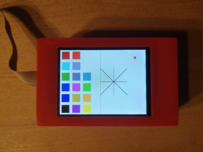

## Screen.jack

A library of functions for displaying graphics on the screen.
The connected `LCD` physical screen consists of 320 rows (indexed 0-319, top to bottom) of 240 pixels each (indexed 0-239, left to right). The top left pixel on the screen is indexed (0,0). Every pixel can be set to a 16 bit color code composed of RGB data with 5 bits red, 6 bits green and 5 bits blue: `rrrrrggggggbbbbb`.

### Special function register LCD

The screen is controlled by sending commands to special function register `LCD` which connects to the `ILI9341V` controller on `MOD-LCD2.8RTP`. Every command is 8 bits long with `DCX=0` pulled low followed by any number (or none) of parameters, which are send with `DCX=1` driven high. All commands are described in the datasheet of [ILI9341V](../../docs/ILI9341V_v1.0.pdf).

**Attention**: Parameters vary in size per command and `ILI9341V` expects to receive all the parameters serially with no padding. For the parameters to be parsed correctly it is necessary to ensure that the relevant 8 bit or 16 bit data transmission method is used by selecting `LCD8` for single byte parameters (e.g. `MADCTL`/`COLMOD`) and `LCD16` for the rest in software.

**Attention**: Hex values are denoted in the format `0xFF`, anything else is an integer literal unless noted otherwise.

To initialize the hardware the following commands must be sent:

* **Memory Access Control (MADCTL, 0x36)**: Send command 54 (`DCX=0`) followed by parameter 72 (1 byte + `DCX=1`) to set the iteration pattern(s) for memory access on `ILI9341V` by inverting the column and RGB order.
* **Pixel Format Set (COLMOD, 0x3A)**: Send command 58 (`DCX=0`) followed by parameter 85 (1 byte + `DCX=1`) to set the pixel format to 16 bit RGB.
* **Sleep Out (SLPOUT, 0x11)**: Send command 17 (`DCX=0`) and wait 120ms to wake `ILI9341V` from sleep mode.
* **Display ON (DISPON, 0x29)**: Send command 41 (`DCX=0`) and wait 120ms to switch the display on.

After initialisation with the previous 4 commands the screen turns on showing a random pattern of RGB colors. To paint something on the screen we must send the following three commands to `LCD`.

* **Column Address Set (CASET, 0x2A)**: To set the x range of the window into which to paint, send command 42 with `DCX=0` followed by 2 x 16 bit parameters `x1` and `x2` with `DCX=1`. `x1` and `x2` must be in the range `0-239` with `x2>=x1`.
* **Page Address Set (PASET, 0x2B):** To set the y range of the window into which to paint, send command 43 with `DCX=0` followed by 2 x 16 bit parameters `y1` and `y2` with `DCX=1`. `y1` and `y2` must be in the range `0-319` with `y2>=y1`.
* **Memory Write (RAMWR, 0x2C):** To paint the pixel in the rectangle defined by `(x1,y1)-(x2,y2)` send command 44 with `DCX=0` followed by `w*h` 16 bit RGB values (`DCX=1`) of every individual pixel in the rectangle starting at top left and ending at bottom right.

The above commands are distributed to three functions of `ScreenExt.jack`:

### function void init(int addr)

Initializes the `LCD` screen by sending the first 4 commands. The `LCD` is memory mapped to the two memory addresses 4105 and 4106 for 8 bit and 16 bit transactions respectively.

### function void setWindow(int x1, int y1, int x2, int y2)

Sets a rectangle window by sending the last 3 commands. `(x1,y1)` is the upper left corner and `(x2,y2)` is the lower right corner of the rectangle window. The next `w*h` calls of `writeRgbData()` will paint the pixels in the rectangle according to the RGB values starting in the upper left corner and ending in the lower right corner.

### function void writeRgbData(int color)

Sends a 16 bit RGB value to paint the next pixel in the window defined by `setWindow()`. This procedure must be called `w*h` times to paint every pixel in the rectangle defined by `setWindow()`.

***

### Project

* Implement `Screen.jack` (original nand2tetris API) and `ScreenExt.jack` (new hardware specific functions). 

  **Attention:** Don't init the other Jack libraries in `Sys.init()` beyond what is included in this folder (`GPIO`, `UART`, `Memory`, `Math`, `Screen`, `ScreenExt`).

* Test in simulation:
  
  ```sh
  $ cd 09_Screen_Test
  $ make
  $ cd ../00_HACK
  $ apio clean
  $ apio sim
  ```
  
  

* Check for the correct init sequence:
  
  * `LCD_CSX` is low starting from the first command.
  * `LCD_DCX` is low while sending commands and high while sending data.
  * `LCD_SDO` shows the serial binary representation of the send command/data.
  * `LCD_SCK` shows 8 cycles.

* Run `Screen_Test` on real hardware on `iCE40HX1K-EVB` with `MOD-LCD2.8RTP` connected as described in `06_IO_Devices/LCD`.
  
  ```sh
  $ cd 09_Screen_Test
  $ make
  $ make upload
  ```

* Compare the pattern on the screen with the following picture:
  
  