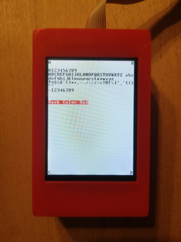

## Output.jack

A library of functions for writing text on the screen.

The `HACK` physical screen consists of 320 rows of 240 pixels each. The library uses a fixed font in which each character is displayed within a frame which is 11 pixels high (including 1 pixel for line spacing) and 8 pixels wide (including 2 pixels for character spacing). The resulting grid accommodates 29 rows (indexed 0-28, top to bottom) of 30 characters each (indexed 0-29, left to right). The top left character position on the screen is indexed (0,0). A cursor implemented as a small filled square indicates where the next character will be displayed.

***

### Project

* Implement `Output.jack`.

  **Attention:** Don't init the other Jack libraries in `Sys.init()` beyond what is included in this folder (`GPIO`, `UART`, `Memory`, `Math`, `Screen`, `ScreenExt`, `Output`).

* Test on real hardware:

  ```sh
  $ cd 10_Output_Test
  $ make
  $ make upload
  ```

* Compare the text on the screen with the following picture:

  