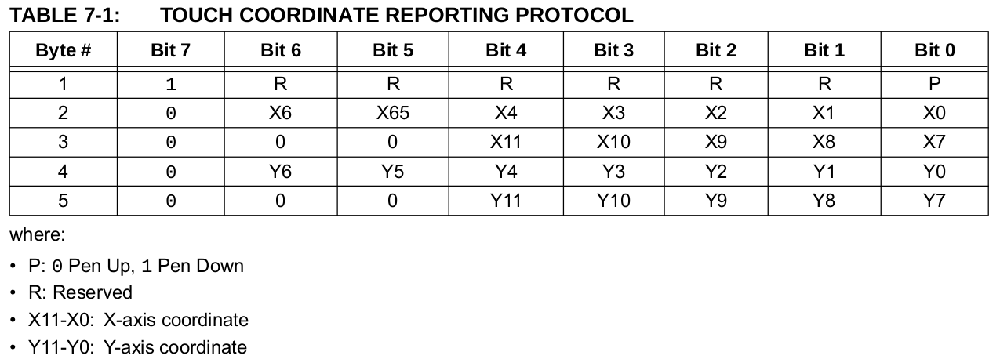
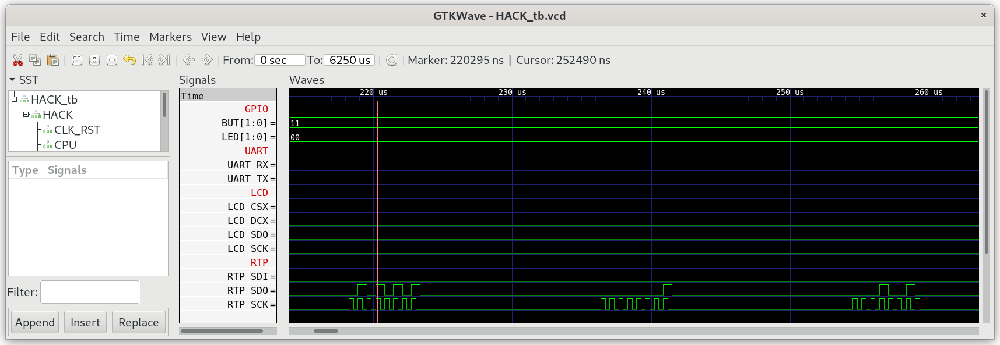

## Touch.jack

A library to read touch events from either of the Resistive Touch Panel controllers `AR1021` or `NS2009`.

### AR1021

Refer to datasheet [AR1021](../../docs/AR1000.pdf) in conjunction with this section.

To read the next touch event read 5 consecutive bytes from RTP: `pen`,`xlow`,`xhigh`,`ylow` and `yhigh`. Between every byte there should be a delay of ~50μs. When no data is available the controller will answer with 77 (0x4D). The event is only valid if the first byte is 128 or 129 and the x and y coordinates are in the range 0-4095.

* **pen**: 128 = pen up, 129 = pen down.
* **xlow**: 7 least significant bits of x coordinate.
* **xhigh**: 5 most significant bits of x coordinate.
* **ylow**: 7 least significant bits of y coordinate.
* **yhigh**: 5 most significant bits of y coordinate.

`(xhigh[4:0] * 128) + xlow[6:0]` represents a 12 bit x coordinate in the range 0-4095.

`(yhigh[4:0] * 128) + ylow[6:0]` represents a 12 bit y coordinate in the range 0-4095.



### NS2009

Refer to datasheet [NS2009](../../docs/NS2009.pdf) in conjunction with this section.

Send a write operation to select the register for the x, y and z (touch pressure) values then read 2 bytes from each to retrieve the 12 bits of touch data per register.

* `set_x_reg`: 192 (0xC0)
* `set_y_reg`: 208 (0xD0)
* `set_z_reg`: 224 (0xE0)
* `read_command`: 256 (0x100)

***

### Project

* Implement `Touch.jack`.

  **Attention:** From this point forward all Jack libraries in `Sys.init()` should be initialized. 

* Test in simulation (`AR1021` only):

  **Attention:** May need a longer simulation time or temporarily disabling compute intensive `init()` calls like `Screen`/`ScreenExt`/`Output` - only `Touch.getEvent()` needs to be reachable for the core functionality of this test. If disabling `Output.init()` then any `Output.print*()` calls should be disabled as well.
  
  ```sh
  $ cd 11_Touch_Test
  $ make
  $ cd ../00_HACK
  $ apio clean
  $ apio sim
  ```
  
  * Check for the inter-byte delay of ~50μs.

  * Check `RTP_SCK` shows 5 blocks of 8 clock cycles.

  * Check `RTP_SDI` traffic corresponds to the values in `../00_HACK/HACK_tb.v`.

  * Check `RTP_SDO` is low while reading data from `RTP`.

  

* Connect the touch panel controller of `MOD-LCD2.8RTP` to `iCE40HX1K-EVB` as described in `06_IO_Devices/07_RTP`.

* Run `Touch_Test` on real hardware on `iCE40HX1K-EVB`. Create some touch events on the resistive touch panel `RTP` and check the messages printed to the screen.
 
  ```sh
  $ cd 11_Touch_Test
  $ make
  $ make upload
  ```